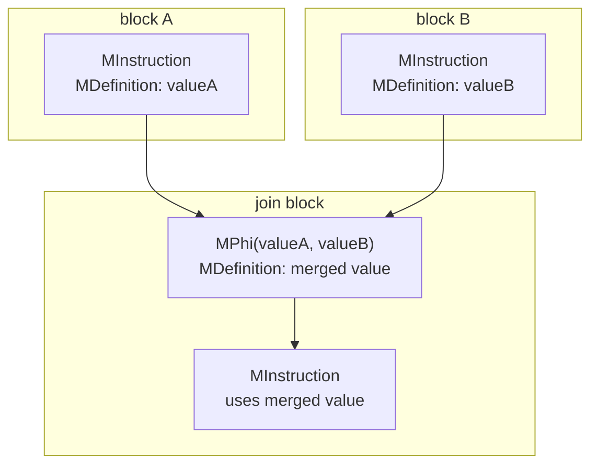

# What The Claude (Bug 2024918): The Phi That Got Away

## Introduction

This writeup is part of **What The Claude**, a series where we analyze and root-cause a few of the browser bugs reported by Claude from Anthropic. In [episode 1](../CVE-2026-2796-wasm-call-bind-import-confusion/), we looked at SpiderMonkey's `Function.prototype.call.bind` import optimization. This time, we'll follow a phi node through SpiderMonkey's JIT pipeline, Wasm GC scalar replacement, and escape analysis.

Let's dig in.

## Summary

According to [Behind the Scenes Hardening Firefox with Claude Mythos Preview](https://hacks.mozilla.org/2026/05/behind-the-scenes-hardening-firefox/):

> An incorrect equality check can cause the JIT to optimize away the initialization of a live WebAssembly GC struct, creating a fake-object primitive with potential arbitrary read/write in code that had undergone extensive fuzzing by internal and external researchers.

[Bug 2024918](https://bugzilla.mozilla.org/show_bug.cgi?id=2024918) is an escape-analysis bypass in SpiderMonkey's Wasm GC scalar replacement. A phi recursion changes the MIR value being inspected, but the store check still compares against the original allocation, so an `anyref` field initializer can be optimized away while the object is still observable. Bugzilla sums it up as "raw nursery garbage in a GC-traced anyref slot."

The vulnerable path is `IsWasmStructEscaped(phi, newStruct)`. When escape analysis recurses through a phi, `ins` becomes the phi being inspected, while `newStruct` remains the original allocation being optimized. In the `WasmStoreFieldRef` case, the code checked whether `value() == newStruct`. But if the store is fed by the phi, the escape check needs to ask whether `value() == ins`, because `ins` is the value whose uses are currently being walked. The buggy check asks `value() == newStruct` instead. In this path, that reduces to `phi == newStruct`, which is false, so the escape is missed.

The bug was this check:

```diff
-        if (def->toWasmStoreFieldRef()->value() == newStruct) {
+        if (def->toWasmStoreFieldRef()->value() == ins) {
```

TL;DR:

- SpiderMonkey's [Wasm GC scalar-replacement pass](https://github.com/mozilla-firefox/firefox/blob/4ff90b57d676a5c25f65f122513dc4b97ee72403/js/src/jit/ScalarReplacement.cpp#L4296) tries to remove `MWasmNewStructObject` allocations when the optimizer can keep the struct's fields in MIR instead of storing them in a real GC heap object.
- To do that safely, [`IsWasmStructEscaped` walks the struct's uses](https://github.com/mozilla-firefox/firefox/blob/4ff90b57d676a5c25f65f122513dc4b97ee72403/js/src/jit/ScalarReplacement.cpp#L3857) and refuses scalar replacement if any use could make the struct visible outside the optimizer's tracked field state.
- When it comes to phi nodes, the analysis first [checks that the phi only merges values from the same original allocation](https://github.com/mozilla-firefox/firefox/blob/4ff90b57d676a5c25f65f122513dc4b97ee72403/js/src/jit/ScalarReplacement.cpp#L3671), then [continues the escape walk from the phi itself](https://github.com/mozilla-firefox/firefox/blob/4ff90b57d676a5c25f65f122513dc4b97ee72403/js/src/jit/ScalarReplacement.cpp#L3917): `IsWasmStructEscaped(phi, newStruct)`.
- After that recursive call, the value whose uses are being inspected is the phi, not the original `MWasmNewStructObject`.
- If a `WasmStoreFieldRef` stores that phi into another struct's reference field, the phi has escaped into heap-visible state and scalar replacement must stop.
- The vulnerable code [compared the store's value against `newStruct` instead of `ins`](https://github.com/mozilla-firefox/firefox/blob/4ff90b57d676a5c25f65f122513dc4b97ee72403/js/src/jit/ScalarReplacement.cpp#L3900), so escape analysis failed to notice the heap store.
- Scalar replacement then treated the struct as non-escaping, so the replacement visitor [modeled the struct's own field initializer in MIR and discarded the runtime store](https://github.com/mozilla-firefox/firefox/blob/4ff90b57d676a5c25f65f122513dc4b97ee72403/js/src/jit/ScalarReplacement.cpp#L3720).
- The struct allocation can still reach the heap through [`wasmNewStructObject` with `zeroFields=false`](https://github.com/mozilla-firefox/firefox/blob/4ff90b57d676a5c25f65f122513dc4b97ee72403/js/src/jit/MacroAssembler.cpp#L7601). With its field initializer removed, the GC-traced `anyref` slot can be left uninitialized.
- This bug can be turned into arbitrary code execution in the renderer process.

The fix landed as [`1c39b127b06b`](https://github.com/mozilla-firefox/firefox/commit/1c39b127b06b161ba0d52412d4b8d188472efbe7) and shipped in Firefox 150 / ESR 140.10 on 2026-04-21. Bug 2024918 was covered by the memory-safety advisory CVE-2026-6786: [MFSA 2026-30](https://www.mozilla.org/en-US/security/advisories/mfsa2026-30/) and [MFSA 2026-32](https://www.mozilla.org/en-US/security/advisories/mfsa2026-32/).


## Setup

- macOS Apple Silicon
- SpiderMonkey at the vulnerable parent [`4ff90b57d676`](https://github.com/mozilla-firefox/firefox/commit/4ff90b57d676a5c25f65f122513dc4b97ee72403)
- Mozilla's [regression](pocs/bug2024918.js), from [Bug 2024918](https://bug2024918.bmoattachments.org/attachment.cgi?id=9555540)

On my local shell, `--wasm-compiler=optimizing` was needed to trigger the crash:

```bash
obj-sm-opt/dist/bin/js \
  --wasm-compiler=optimizing \
  pocs/bug2024918.js
```

Output:

```text
zsh: segmentation fault  obj-sm-opt/dist/bin/js --wasm-compiler=optimizing pocs/bug2024918.js
```

Under `lldb`, the same run crashes in JIT:

```text
Process 75951 launched: '.../obj-sm-opt/dist/bin/js' (arm64)
Process 75951 stopped
* thread #1, queue = 'com.apple.main-thread', stop reason = EXC_BAD_ACCESS (code=1, address=0xfff9800000000000)
    frame #0: 0x000011a7b0fd8ae8
->  0x11a7b0fd8ae8: ldr    x9, [x9]
    0x11a7b0fd8aec: ldr    x9, [x9]
    0x11a7b0fd8af0: ldr    x16, [x23, #0x98]
    0x11a7b0fd8af4: cmp    x16, x9
    0x11a7b0fd8af8: b.eq   0x11a7b0fd8b00
    0x11a7b0fd8afc: b      0x11a7b0fd8b04
    0x11a7b0fd8b00: ldr    x2, [x0, #0x18]
Target 0: (js) stopped.
(lldb) register read pc x9 x10 x23
      pc = 0x000011a7b0fd8ae8
      x9 = 0xfff9800000000000
     x10 = 0x00000f314a560880
     x23 = 0x000000010759dd00
```

Running the same testcase with scalar replacement disabled exits normally:

```bash
obj-sm-opt/dist/bin/js \
  --wasm-compiler=optimizing \
  --ion-scalar-replacement=off \
  pocs/bug2024918.js
```

Output:

```text
final: -1052688063
```

## Background

Before we look at scalar replacement, it helps to zoom out a bit.

### From Wasm to MIR

Ion is SpiderMonkey's optimizing compiler tier. It does not optimize Wasm text directly. Mozilla's SpiderMonkey docs describe [WASM-Ion](https://firefox-source-docs.mozilla.org/js/index.html#wasm-ion-baldrmonkey) as the engine that translates Wasm input into "the same MIR form that WarpMonkey uses" and then uses the Ion backend to optimize it.

Ion works on [MIR, the Middle-level Intermediate Representation](https://firefox-source-docs.mozilla.org/js/MIR-optimizations/index.html): a graph of instructions arranged in basic blocks. MIR values are represented by [`MDefinition`](https://github.com/mozilla-firefox/firefox/blob/4ff90b57d676a5c25f65f122513dc4b97ee72403/js/src/jit/MIR.h#L507)-derived nodes. An MIR instruction defines a value, later MIR instructions use that value, and control-flow joins are represented with [`MPhi`](https://github.com/mozilla-firefox/firefox/blob/4ff90b57d676a5c25f65f122513dc4b97ee72403/js/src/jit/MIR.h#L5900). That value/use model is important for the scalar-replacement pass we will look at later on.

For instance:

```javascript
let x;
if (cond) {
  x = valueA; // block A: valueA
} else {
  x = valueB; // block B: valueB
}
use(x); // join: x = MPhi(valueA, valueB), then use(x)
```



Here each instruction node is also an `MDefinition`: it defines the value that later nodes use. `MPhi` is the join-block definition that represents the value at the join point (`valueA` on the `if` path, `valueB` on the `else` path).

At the Wasm level, the trigger is mostly about three operations:

```wat
(local.set $s2 (struct.new $Inner (ref.i31 (i32.const 0xff))))
(struct.set $Outer 0 (local.get $s1) (local.get $s2))
(struct.get $Outer 0 (local.get $s1))
```

First, `struct.new` creates the object. In Ion, [`FunctionCompiler::emitStructNew`](https://github.com/mozilla-firefox/firefox/blob/4ff90b57d676a5c25f65f122513dc4b97ee72403/js/src/wasm/WasmIonCompile.cpp#L8888) lowers that operation by creating a struct object and then emitting stores for the initializer fields:

```cpp
bool FunctionCompiler::emitStructNew() {
  ...
  MDefinition* structObject =
      createStructObject(typeIndex, allocSiteIndex, false);

  for (uint32_t fieldIndex = 0; fieldIndex < structType.fields_.length();
       fieldIndex++) {
    writeValueToStructField(..., structObject, args[fieldIndex], ...);
  }

  iter().setResult(structObject);
  return true;
}
```

The allocation itself is produced by [`createStructObject`](https://github.com/mozilla-firefox/firefox/blob/4ff90b57d676a5c25f65f122513dc4b97ee72403/js/src/wasm/WasmIonCompile.cpp#L5119), which creates an `MWasmNewStructObject`:

```cpp
MDefinition* createStructObject(uint32_t typeIndex,
                                uint32_t allocSiteIndex,
                                bool zeroFields) {
  ...
  auto* structObject =
      MWasmNewStructObject::New(alloc(), instancePointer_, allocSite, typeDef,
                                zeroFields, trapSiteDesc());
  curBlock_->add(structObject);
  return structObject;
}
```

For this `struct.new` lowering, the `zeroFields` argument is `false`. That means the allocation is created first, and the initializer values are represented by the field-store MIR nodes emitted just after it (`MWasmStoreField` for primitive fields, `MWasmStoreFieldRef` for reference fields).

Next, `struct.set` writes a field. [`FunctionCompiler::emitStructSet`](https://github.com/mozilla-firefox/firefox/blob/4ff90b57d676a5c25f65f122513dc4b97ee72403/js/src/wasm/WasmIonCompile.cpp#L8952) reads two MIR values from the Wasm iterator: the struct being written to and the value being stored.

```cpp
bool FunctionCompiler::emitStructSet() {
  ...
  MDefinition* structObject;
  MDefinition* value;
  if (!iter().readStructSet(&typeIndex, &fieldIndex, &structObject, &value)) {
    return false;
  }

  return writeValueToStructField(..., structObject, value, ...);
}
```

For reference fields, [`writeValueToStructField` emits an `MWasmStoreFieldRef`](https://github.com/mozilla-firefox/firefox/blob/4ff90b57d676a5c25f65f122513dc4b97ee72403/js/src/wasm/WasmIonCompile.cpp#L4935):

```cpp
bool writeValueToStructField(..., MDefinition* structObject,
                             MDefinition* value, ...) {
  ...
  auto* store = MWasmStoreFieldRef::New(
      alloc(), instancePointer_, base, keepAlive, offset,
      mozilla::Some(fieldIndex), value, AliasSet::Store(aliasBitset),
      mozilla::Some(trapSiteDesc()), preBarrierKind);
  curBlock_->add(store);
}
```

For this bug, the important part is that `MWasmStoreFieldRef` separates the destination object from the value being stored. We will come back to that after looking at `struct.get`.

Finally, `struct.get` reads a field. [`FunctionCompiler::emitStructGet`](https://github.com/mozilla-firefox/firefox/blob/4ff90b57d676a5c25f65f122513dc4b97ee72403/js/src/wasm/WasmIonCompile.cpp#L8976) emits a field read and exposes that read as the result of the Wasm operation:

```cpp
bool FunctionCompiler::emitStructGet(FieldWideningOp wideningOp) {
  ...
  MDefinition* load =
      readValueFromStructField(structType, fieldIndex, wideningOp, structObject);
  iter().setResult(load);
  return true;
}
```

So the Wasm-to-MIR mapping is:

| Wasm op | MIR |
| --- | --- |
| `struct.new` | `MWasmNewStructObject` |
| `struct.set` ref field | `MWasmStoreFieldRef(base, value)` |
| `struct.get` field | `MWasmLoadField(base)` |
| control-flow join | `MPhi` |

The loop-body `struct.set $Container` is the store we will keep coming back to. At the Wasm level, it looks like this:

```wat
;; $container.field0 = $s1.field0
(struct.set $Container 0
  (local.get $container)
  (struct.get $Outer 0 (local.get $s1)))
```

Ion lowers that field write into an `MWasmStoreFieldRef` with two operands we need to keep in mind:

```text
MWasmStoreFieldRef(
  base  = $container   // which heap object receives the field write
  value = $s1.field0   // which reference gets written into that object
)
```

The two operands matter because escape analysis and replacement ask different questions. Escape analysis asks whether the current tracked value is being stored as `value`. Replacement asks whether this is a field write to the struct currently being scalar-replaced.

### Wasm GC Structs

[Wasm GC](https://github.com/WebAssembly/gc/blob/main/proposals/gc/Overview.md) gives WebAssembly garbage-collected heap objects, independent from linear memory, so high-level languages can use objects directly in Wasm. For this bug, the relevant Wasm GC object is a struct. A struct is a typed heap object with fields known to the engine ahead of time: `struct.new` allocates one, `struct.set` writes one of its fields, and `struct.get` reads one back.

The regression testcase uses three structs:

```wat
(type $Inner (struct (field (mut anyref))))
(type $Outer (struct (field (mut (ref null $Inner)))))
(type $Container (struct (field (mut (ref null $Inner)))))
```

SpiderMonkey keeps that layout in [`StructType`](https://github.com/mozilla-firefox/firefox/blob/4ff90b57d676a5c25f65f122513dc4b97ee72403/js/src/wasm/WasmTypeDef.h#L305):

```cpp
class StructType {
 public:
  // Vector of the fields in this struct
  FieldTypeVector fields_;

  // The offsets of fields that must be traced in the inline portion of wasm
  // struct object. Offsets are from the base of the WasmStructObject.
  InlineTraceOffsetVector inlineTraceOffsets_;

  // The offsets of fields that must be traced in the outline portion of wasm
  // struct object.
  OutlineTraceOffsetVector outlineTraceOffsets_;
};
```

For `$Inner`, that means SpiderMonkey records both the field type (`anyref`) and the fact that the field must be visited by the GC. At runtime, those structs become [`WasmStructObject`](https://github.com/mozilla-firefox/firefox/blob/4ff90b57d676a5c25f65f122513dc4b97ee72403/js/src/wasm/WasmGcObject.h#L572)s:

```cpp
// Class for a wasm struct. It has inline data and, if the inline area is
// insufficient, a pointer to outline data that lives in the C++ heap.
//
// For our purposes a WasmStructObject is always followed immediately by an
// in-line data area, with maximum size WasmStructObject_MaxInlineBytes.
```

For reference fields, SpiderMonkey later walks those trace offsets in [`WasmStructObject::obj_trace`](https://github.com/mozilla-firefox/firefox/blob/4ff90b57d676a5c25f65f122513dc4b97ee72403/js/src/wasm/WasmGcObject.cpp#L477):

```cpp
void WasmStructObject::obj_trace(JSTracer* trc, JSObject* object) {
  WasmStructObject& structObj = object->as<WasmStructObject>();

  const auto& structType = structObj.typeDef().structType();
  for (uint32_t offset : structType.inlineTraceOffsets_) {
    AnyRef* fieldPtr = reinterpret_cast<AnyRef*>((uint8_t*)&structObj + offset);
    TraceManuallyBarrieredEdge(trc, fieldPtr, "wasm-struct-field");
  }

  ...
}
```

So `$Inner.field0` is not just ordinary/primitive data. During GC, SpiderMonkey reads that slot as a reference.

### Scalar Replacement

[Scalar replacement](https://github.com/mozilla-firefox/firefox/blob/4ff90b57d676a5c25f65f122513dc4b97ee72403/js/src/jit/ScalarReplacement.cpp#L4226) is a way to skip an allocation when the compiler can track the object itself. For a Wasm struct, instead of creating a heap object and storing its fields in memory, SpiderMonkey can keep a compiler-side record like:

```text
field0 = valueA
field1 = valueB
```

Then, when later code reads `field0`, the compiler can use `valueA` directly instead of loading `field0` from a heap object. That saves allocation work, field stores, field loads, and GC pressure, but it only works if the compiler can confidently prove that **nobody outside the modeled MIR state can observe the real object**.

The Wasm-struct part starts in the scalar-replacement pass. SpiderMonkey [only runs the replacement visitor for an optimizable `MWasmNewStructObject` when `IsWasmStructEscaped(*ins, *ins)` returns false](https://github.com/mozilla-firefox/firefox/blob/4ff90b57d676a5c25f65f122513dc4b97ee72403/js/src/jit/ScalarReplacement.cpp#L4296):

```cpp
if (IsOptimizableWasmStructInstruction(*ins) &&
    !IsWasmStructEscaped(*ins, *ins)) {
  WasmStructMemoryView view(graph.alloc(), *ins);
  if (!replaceWasmStructs.run(view)) {
    return false;
  }
  view.assertSuccess();
  addedPhi = true;
  continue;
}
```

The call passes the same MIR node twice. Inside [`IsWasmStructEscaped`](https://github.com/mozilla-firefox/firefox/blob/4ff90b57d676a5c25f65f122513dc4b97ee72403/js/src/jit/ScalarReplacement.cpp#L3857), those two arguments are named `ins` and `newStruct`:

```cpp
static bool IsWasmStructEscaped(MDefinition* ins, MInstruction* newStruct)
```

`ins` is the value whose uses are being inspected right now. `newStruct` is the original allocation being optimized. In the initial call they both point to the same `MWasmNewStructObject`. After the analysis [recurses through a phi with `IsWasmStructEscaped(phi, newStruct)`](https://github.com/mozilla-firefox/firefox/blob/4ff90b57d676a5c25f65f122513dc4b97ee72403/js/src/jit/ScalarReplacement.cpp#L3917), `ins` can become the phi while `newStruct` stays the original allocation.

If escape analysis says the struct is safe, SpiderMonkey [creates a `WasmStructMemoryView` and runs the replacement visitor](https://github.com/mozilla-firefox/firefox/blob/4ff90b57d676a5c25f65f122513dc4b97ee72403/js/src/jit/ScalarReplacement.cpp#L4298):

```cpp
WasmStructMemoryView view(graph.alloc(), *ins);
if (!replaceWasmStructs.run(view)) {
  return false;
}
```

From there, stores to the struct update the compiler's field state:

```cpp
void WasmStructMemoryView::visitWasmStoreFieldRef(MWasmStoreFieldRef* ins) {
  ...
  state_->setField(ins->structFieldIndex().value(), ins->value());
  ins->block()->discard(ins);
}
```

Loads from the struct are replaced with values from that state:

```cpp
void WasmStructMemoryView::visitWasmLoadField(MWasmLoadField* ins) {
  ...
  MDefinition* value = state_->getField(ins->structFieldIndex().value());
  ins->replaceAllUsesWith(value);
  ins->block()->discard(ins);
}
```

That field state is not the Wasm object in memory. It is [`MWasmStructState`, the compiler's record of what value each struct field should have at that point in the MIR](https://github.com/mozilla-firefox/firefox/blob/4ff90b57d676a5c25f65f122513dc4b97ee72403/js/src/jit/MIR-wasm.h#L3258). [`state_->setField(...)` updates that record](https://github.com/mozilla-firefox/firefox/blob/4ff90b57d676a5c25f65f122513dc4b97ee72403/js/src/jit/ScalarReplacement.cpp#L3735). [`state_->getField(...)` reads it back so the real `MWasmLoadField` can be replaced](https://github.com/mozilla-firefox/firefox/blob/4ff90b57d676a5c25f65f122513dc4b97ee72403/js/src/jit/ScalarReplacement.cpp#L3748).

### Escape Analysis

The replacement visitor can only model a small set of operations: stores to the struct, loads from the struct, and simple phi flows. [`IsWasmStructEscaped` walks the uses of the current MIR value](https://github.com/mozilla-firefox/firefox/blob/4ff90b57d676a5c25f65f122513dc4b97ee72403/js/src/jit/ScalarReplacement.cpp#L3857) to check whether the current use graph still fits that model. If it finds a use the visitor cannot model, or a use that can put the struct into another heap object, it returns `true` and scalar replacement stops. Below is the relevant decision logic annotated with `// RCA`-style comments:

```cpp
static bool IsWasmStructEscaped(MDefinition* ins, MInstruction* newStruct) {
  // RCA: `ins` is the current cursor. The loop below walks uses of `ins`.
  // RCA: `newStruct` is the original allocation being optimized.
  MOZ_ASSERT(ins->type() == MIRType::WasmAnyRef);
  MOZ_ASSERT(IsOptimizableWasmStructInstruction(newStruct));

  ...

  for (MUseIterator i(ins->usesBegin()); i != ins->usesEnd(); i++) {
    MNode* consumer = (*i)->consumer();

    if (!consumer->isDefinition()) {
      // RCA: unknown/non-definition consumers are treated as escapes.
      JitSpew(JitSpew_Escape, "Wasm struct is escaped");
      return true;
    }

    MDefinition* def = consumer->toDefinition();
    switch (def->op()) {
      case MDefinition::Opcode::WasmStoreField: {
        // RCA: primitive fields cannot store a Wasm struct reference.
        break;
      }
      case MDefinition::Opcode::WasmStoreFieldRef: {
        // RCA: reference-field stores can put this value into another heap object.
        // BUG: this compares against `newStruct`, not the current cursor `ins`.
        if (def->toWasmStoreFieldRef()->value() == newStruct) {
          JitSpewDef(JitSpew_Escape, "is escaped by\n", def);
          return true;
        }
        break;
      }
      case MDefinition::Opcode::WasmLoadField: {
        // RCA: loading a field from the struct does not by itself make it escape.
        break;
      }
      case MDefinition::Opcode::Phi: {
        auto* phi = def->toPhi();
        if (!WasmStructPhiOperandsEqualTo(phi, newStruct)) {
          // RCA: different phi operands mean the cursor can no longer be modeled as the same original allocation.
          JitSpewDef(JitSpew_Escape, "has different phi operands\n", def);
          return true;
        }
        // RCA: after this call, `ins` in the callee is the phi.
        if (IsWasmStructEscaped(phi, newStruct)) {
          JitSpewDef(JitSpew_Escape, "is indirectly escaped by\n", def);
          return true;
        }
        break;
      }
      default:
        // RCA: anything unfamiliar is treated as an escape.
        JitSpewDef(JitSpew_Escape, "is escaped by\n", def);
        return true;
    }
  }

  JitSpew(JitSpew_Escape, "Struct is not escaped");
  return false;
}
```

The `WasmStoreFieldRef` case is where reference fields matter. If the current tracked value is being stored as the `value()` of another struct's field, then another heap object can now point at it. That should count as an escape.

One detail matters later: escape analysis and replacement look at different operands of `MWasmStoreFieldRef`. Escape analysis cares about `value()` because storing the current value into another object means it escaped. Replacement cares about `base()` because it only models field writes to the struct currently being replaced.

For a store like:

```text
container.field0 = s2
```

escape analysis asks:

```text
value == s2?
```

because `s2` is being placed inside another object. Replacement asks:

```text
base == s2?
```

because it only records writes to `s2`'s own fields. So the same store means different things to the two parts of the pass:

```text
MWasmStoreFieldRef(
  base  = container,
  value = s2
)
```

Escape analysis sees `value = s2` and should stop. Replacement sees `base = container` and ignores it, because it is not a write to `s2.field0`.

### Phi Nodes

A phi node is the compiler's way of naming a value that can come from more than one control-flow path.

A loop has a **header**, the block where each iteration begins. Control can arrive at the header from two places: the code before the loop, or the **back edge**, which is the jump from the end of the loop body back to the header. The **body** is the code that runs on each iteration.

For a loop, the value at the header can come from before the loop starts, or from the previous iteration:

```javascript
let x = before;

// loop header
while (cond) {
  // loop body
  use(x);

  // value for the next iteration
  x = next;
}
// back edge jumps to the header
```

At the loop header, MIR can represent `x` like this:

```text
x_at_header = MPhi(before, next_from_previous_iteration)
```

For this bug, the only thing to remember is that later MIR instructions can use the phi instead of the value that flowed into it.

## The Trigger

[Mozilla's regression](pocs/bug2024918.js) starts with three structs and a global. `$Inner` has the `anyref` field we want to read back. `$Outer` carries a nullable `$Inner` reference through the loop. `$Container` is stored in the global, so `read()` can load it after `run()` returns.

```wat
;; struct Inner {
;;   field0; // anyref
;; }
(type $Inner (struct (field (mut anyref))))

;; struct Outer {
;;   field0; // Inner | null
;; }
(type $Outer (struct (field (mut (ref null $Inner)))))

;; struct Container {
;;   field0; // Inner | null
;; }
(type $Container (struct (field (mut (ref null $Inner)))))

;; let g = null; // Container | null
(global $g (mut (ref null $Container)) (ref.null $Container))
```

The setup starts with the object scalar replacement wants to remove:

```wat
;; $s2 = new Inner(0x41414141)
(local.set $s2 (struct.new $Inner (ref.i31 (i32.const 0x41414141))))
```

Equivalent pseudocode:

```javascript
let s2 = new Inner();
s2.field0 = 0x41414141;
```

Compiler view:

```text
s2 = MWasmNewStructObject(Inner)
s2.field0 = 0x41414141
```

This gives us **Store A**, the initializer store. If scalar replacement later decides `s2` does not escape, this is the store it will record in field state and remove from the MIR graph.

Next, the testcase creates `$s1` and stores `$s2` into `$s1.field0` before the loop:

```wat
;; $s1 = new Outer(null)
(local.set $s1 (struct.new $Outer (ref.null $Inner)))

;; $s1.field0 = $s2
(struct.set $Outer 0 (local.get $s1) (local.get $s2))
```

Equivalent pseudocode:

```javascript
let s1 = new Outer();
s1.field0 = s2;
```

Compiler view:

```text
s1.field0 = s2
```

This is the first input to the loop phi. On the first iteration, `s1.field0` starts as `s2`.

Next, the testcase creates `$Container` and stores it in the global:

```wat
;; $container = new Container(null)
(local.set $container (struct.new $Container (ref.null $Inner)))

;; Keep $container reachable after run() returns.
(global.set $g (local.get $container))
```

Equivalent pseudocode:

```javascript
let container = new Container();
g = container;
```

This gives `read()` a way back to `container` after `run()` returns. It can start from `g`, load `container`, and follow whatever was stored in `container.field0`.

The loop has the two lines that matter:

```wat
(loop $L
  ;; $container.field0 = $s1.field0
  ;; This is the store that should make $s2 escape.
  (struct.set $Container 0
    (local.get $container)
    (struct.get $Outer 0 (local.get $s1)))

  ;; $s1.field0 = $s2
  ;; Before the next iteration, put $s2 back in $s1.field0.
  (struct.set $Outer 0 (local.get $s1) (local.get $s2))

  ;; i++
  (local.set $i (i32.add (local.get $i) (i32.const 1)))

  ;; repeat while i < n
  (br_if $L (i32.lt_s (local.get $i) (local.get $n)))
)
```

Equivalent pseudocode:

```javascript
for (let i = 0; i < n; i++) {
  container.field0 = s1.field0;
  s1.field0 = s2;
}
```

The first line is **Store B**:

```text
container.field0 = s1.field0
```

This is the store escape analysis must catch. `container` is reachable through `g`, so writing `s2` into `container.field0` keeps `s2` reachable after `run()` returns.

The second line sets up the value seen at the start of the next iteration:

```text
s1.field0 = s2
```

At the start of a loop iteration, `s1.field0` can come from two places:

```text
before the loop:    s1.field0 = s2
previous iteration: s1.field0 = s2
```

So MIR can describe the value of `s1.field0` at the loop header as:

```text
phi_for_s1_field0 = MPhi(s2 from before the loop,
                         s2 from the previous iteration)
```

Both inputs are `s2`. That is why scalar replacement later accepts this phi and can replace the phi with `s2`. For now, the important part is that Store B is seen as:

```text
container.field0 = phi_for_s1_field0
```

This is the exact store that should make escape analysis stop scalar replacement.

Finally, `read()` loads the global container and reads the nested fields:

```wat
(func (export "read") (result anyref)
  (struct.get $Inner 0 (struct.get $Container 0 (global.get $g))))
```

Equivalent pseudocode:

```javascript
function read() {
  return g.field0.field0;
}
```

Read it as:

```text
g -> container -> s2 -> s2.field0
```

Putting those pieces together, the (pseudo) trigger is:

```javascript
let g = null;

function run(n) {
  let s1 = new Outer();
  let s2 = new Inner();
  let container = new Container();

  // Store A:
  // s2.field0 should be 0x41414141.
  // Compiler: s2 is the MWasmNewStructObject scalar replacement wants to remove.
  // Compiler: this write can be recorded as field state and removed.
  s2.field0 = 0x41414141;

  // First phi input:
  // before the loop, s1.field0 is s2.
  s1.field0 = s2;

  // Keep container reachable after run() returns.
  g = container;

  for (let i = 0; i < n; i++) {
    // Store B:
    // copy s1.field0 into the reachable container.
    //
    // Compiler:
    //   s1.field0 at the loop header is:
    //     phi = MPhi(s2, s2)
    //   so this store becomes:
    //     container.field0 = phi
    //
    // Escape analysis must notice this.
    container.field0 = s1.field0;

    // Second phi input:
    // before the loop repeats, s1.field0 is s2 again.
    s1.field0 = s2;
  }
}

function read() {
  // g holds container.
  // container.field0 holds s2.
  // s2.field0 should still be 0x41414141.
  return g.field0.field0;
}
```

If escape analysis gets this right, scalar replacement stops and `read()` returns `0x41414141`. The question now is why Store B did not make `s2` escape.

## Root Cause

The bug is that `IsWasmStructEscaped` follows the phi, but the store check still compares against the original allocation.

### The Recursive Call

By the time escape analysis reaches the missed store, the relevant MIR state is:

```text
phi = MPhi(s2, s2)

container.field0 = phi
```

The first call starts on the original allocation:

```cpp
IsWasmStructEscaped(ins = s2, newStruct = s2);
```

It sees the phi. Since both phi inputs are still the original allocation, `WasmStructPhiOperandsEqualTo(phi, newStruct)` accepts it:

```cpp
if (!WasmStructPhiOperandsEqualTo(phi, newStruct)) {
  JitSpewDef(JitSpew_Escape, "has different phi operands\n", def);
  return true;
}
```

Then escape analysis recurses into the phi, while `newStruct` still refers to `s2`:

```cpp
if (IsWasmStructEscaped(phi, newStruct)) {
  JitSpewDef(JitSpew_Escape, "is indirectly escaped by\n", def);
  return true;
}
```

At the missed store, the call stack looks like this:

```text
+----------------------------------------------+
| #0 IsWasmStructEscaped(ins = phi,            |
|                         newStruct = s2)      |
|----------------------------------------------|
| #1 IsWasmStructEscaped(ins = s2,             |
|                         newStruct = s2)      |
+----------------------------------------------+
```

Frame `#0` is where the bug happens. The function is walking uses of `ins`; in this frame, `ins` is `phi`:

```cpp
for (MUseIterator i(ins->usesBegin()); i != ins->usesEnd(); i++) {
  MNode* consumer = (*i)->consumer();
  ...
}
```

One of those consumers is the store into `container.field0`:

```text
MWasmStoreFieldRef(
  base  = container,
  value = phi
)
```

That store should stop scalar replacement. The value being checked is written into `container`, and `container` is saved in the global. The vulnerable check [compared the store's value operand with `newStruct`](https://github.com/mozilla-firefox/firefox/blob/4ff90b57d676a5c25f65f122513dc4b97ee72403/js/src/jit/ScalarReplacement.cpp#L3900), not with `ins`:

```cpp
case MDefinition::Opcode::WasmStoreFieldRef: {
  // Escaped if it's stored into another struct.
  if (def->toWasmStoreFieldRef()->value() == newStruct) {
    JitSpewDef(JitSpew_Escape, "is escaped by\n", def);
    return true;
  }
  break;
}
```

In frame `#0`, `store.value()` is `phi`, but `newStruct` is still `s2`, so the buggy check asks `phi == s2` and returns false. The check needed to compare against the current cursor, `ins`. In this frame that means `phi == phi`, which returns true.


### How the Field Store Gets Removed

With `s2` treated as non-escaping, the replacement visitor is allowed to model `s2`'s own fields in MIR. For the initializer:

```wat
(local.set $s2 (struct.new $Inner (ref.i31 (i32.const 0x41414141))))
```

Ion lowers that into an `MWasmNewStructObject` followed by an `MWasmStoreFieldRef`. The first creates the `Inner` object, the second stores the initializer into `s2.field0`.

```text
s2 = MWasmNewStructObject(Inner)

MWasmStoreFieldRef(
  base  = s2,
  value = 0x41414141
)
```

When scalar replacement is working on `s2`, a store with `base = s2` is treated as a store to one of `s2`'s own fields. [`visitWasmStoreFieldRef` records that value in the compiler's field state, then drops the MIR instruction with `discard(ins)`](https://github.com/mozilla-firefox/firefox/blob/4ff90b57d676a5c25f65f122513dc4b97ee72403/js/src/jit/ScalarReplacement.cpp#L3720):

```cpp
void WasmStructMemoryView::visitWasmStoreFieldRef(MWasmStoreFieldRef* ins) {
  // RCA: `struct_` is the allocation currently being scalar-replaced.
  // For the initializer store, this is `s2`.

  // Skip stores made on other structs.
  MDefinition* base = ins->base();
  if (base != struct_) {
    return;
  }

  // Clone the state and update the field value.
  state_ = BlockState::Copy(alloc_, state_);
  if (!state_) {
    oom_ = true;
    return;
  }

  // RCA: remember "s2.field[index] = value" in compiler state.
  // After this, later loads from s2.field[index] can use this MIR value.
  state_->setField(ins->structFieldIndex().value(), ins->value());

  // RCA: remove the MIR store, so no runtime write to s2.field0 is generated.
  ins->block()->discard(ins);
}
```

The removal is the last line. Once `ins->block()->discard(ins)` runs, that `MWasmStoreFieldRef` is no longer in the MIR graph, so later compiler stages cannot generate the `s2.field0 = 0x41414141` write from it.

There are two stores to keep separate:

```text
Store A:
s2.field0 = 0x41414141

Store B:
container.field0 = s2
```

Store A is removed on purpose. Scalar replacement sees a write to a field of `s2`, records the value, and removes the store instruction:

```text
s2.field0 = 0x41414141
```

becomes something like:

```text
state[s2.field0] = 0x41414141
```

In other words:

```text
remember: s2.field0 is 0x41414141
remove:   s2.field0 = 0x41414141
```

That is only safe **if nobody can reach the real `s2` object later**. But Store B still exists. `container` is saved in the global, so after `run()` returns, `read()` can still reach:

```text
g -> container -> s2
```

So we get:

```text
Store A was removed:
s2.field0 = 0x41414141

Store B stayed:
container.field0 = s2
```

That means `read()` can reach the `s2` object, but the write that initialized `s2.field0` never happened.

The phi is how Store B gets there. Before scalar replacement, Store B is written as:

```text
container.field0 = phi
```

and the phi is:

```text
phi = MPhi(s2, s2)
```

That matters because `visitPhi` only handles phis whose inputs match the struct being replaced. Here both inputs are `s2`, so the phi passes that check. During replacement, [`visitPhi` replaces uses of the accepted phi with `struct_`, which is `s2`](https://github.com/mozilla-firefox/firefox/blob/4ff90b57d676a5c25f65f122513dc4b97ee72403/js/src/jit/ScalarReplacement.cpp#L3682):

```cpp
void WasmStructMemoryView::visitPhi(MPhi* ins) {
  // Skip phis on other objects.
  if (!WasmStructPhiOperandsEqualTo(ins, struct_)) {
    return;
  }

  // Replace the phi by its object.
  ins->replaceAllUsesWith(struct_);

  // Remove original instruction.
  ins->block()->discardPhi(ins);
}
```

So scalar replacement turns:

```text
container.field0 = phi
```

into:

```text
container.field0 = s2
```

Final state:

```text
container.field0 = s2          // read() can reach s2
s2.field0 = 0x41414141         // removed
```

The MIR dump confirms the same thing. Before scalar replacement, the initializer store writes to `s2.field0`:

```text
# s2.field0 = ref.i31(0x41414141)
# #16 is s2.
# #13 is ref.i31(0x41414141).
17 = None.WasmStoreFieldRef (offs=16) 1 16 13 16
#                                         base=#16 value=#13
```

After scalar replacement, `s2` is renumbered to `#5`. The remaining store writes `s2` into `container.field0`:

```text
# container.field0 = s2
# #8 is container.
# #5 is s2.
20 = None.WasmStoreFieldRef (offs=16) 1 8 5 8
#                                        base=#8 value=#5
```

The important part is where `#5` appears. A write to `s2.field0` would have `base = #5`. Here `#5` is the `value`, not the `base`, so this store writes `s2` into `container`. It does not write anything into `s2.field0`.

After scalar replacement, the relevant code is effectively:

```javascript
let s1 = new Outer();
let s2 = new Inner();
let container = new Container();

// Store A was removed:
// s2.field0 = 0x41414141;

s1.field0 = s2;
g = container;

for (let i = 0; i < n; i++) {
  // Store B stayed, after phi was replaced with s2.
  container.field0 = s2;

  // This is still the value for the next iteration.
  s1.field0 = s2;
}
```

This leaves `container.field0` pointing at `s2`, while `s2.field0` was never initialized.

In an optimized build before the fix, [`assertSuccess()` was compiled away outside debug builds](https://github.com/mozilla-firefox/firefox/blob/4ff90b57d676a5c25f65f122513dc4b97ee72403/js/src/jit/ScalarReplacement.cpp#L3621), so the release shell kept going even if the original allocation was still used:

```cpp
#ifdef DEBUG
  void assertSuccess();
#else
  void assertSuccess() {}
#endif
```

At runtime, the object allocation path [only zeroes fields when `zeroFields` is true](https://github.com/mozilla-firefox/firefox/blob/4ff90b57d676a5c25f65f122513dc4b97ee72403/js/src/jit/MacroAssembler.cpp#L7601):

```cpp
void MacroAssembler::wasmNewStructObject(..., bool zeroFields) {
  ...
  wasmBumpPointerAllocate(instance, result, allocSite, temp, fail, sizeBytes);

  ...

  if (zeroFields) {
    for (size_t i = wasm::WasmStructObject_Size_ASSUMED; i < sizeBytes;
         i += sizeof(void*)) {
      storePtr(ImmWord(0), Address(result, i));
    }
  }
}
```

For this testcase's `struct.new`, [`emitStructNew` calls `createStructObject(..., false)`](https://github.com/mozilla-firefox/firefox/blob/4ff90b57d676a5c25f65f122513dc4b97ee72403/js/src/wasm/WasmIonCompile.cpp#L8888), so the allocation reaches `wasmNewStructObject` with `zeroFields = false`. Since the write to `s2.field0` was removed, the field can contain whatever was already in that slot (nursery bytes, which can be influenced with heap spraying). Because `$Inner.field0` is an `anyref`, SpiderMonkey later treats those bytes as a reference.

## The Patch

The [patch](https://github.com/mozilla-firefox/firefox/commit/1c39b127b06b161ba0d52412d4b8d188472efbe7) changes the comparison from the original allocation to the current cursor:

```diff
 case MDefinition::Opcode::WasmStoreFieldRef: {
   // Escaped if it's stored into another struct.
-  if (def->toWasmStoreFieldRef()->value() == newStruct) {
+  if (def->toWasmStoreFieldRef()->value() == ins) {
     JitSpewDef(JitSpew_Escape, "is escaped by\n", def);
     return true;
   }
   break;
 }
```

After that change, the recursive phi call sees the store into `$Container.field0`, compares `store.value()` with the current `ins`, and returns escaped. Scalar replacement does not run on this `$Inner`, so the `s2.field0 = 0x41414141` write is kept.

The patch also [turns `assertSuccess()` into a release assertion](https://github.com/mozilla-firefox/firefox/blob/1c39b127b06b161ba0d52412d4b8d188472efbe7/js/src/jit/ScalarReplacement.cpp#L3638):

```diff
-#ifdef DEBUG
 void assertSuccess();
-#else
-void assertSuccess() {}
-#endif

 void WasmStructMemoryView::assertSuccess() {
   // Make sure that the undefined value used as a placeholder is not used.
-  MOZ_ASSERT(!undefinedVal_->hasUses());
+  MOZ_RELEASE_ASSERT(!undefinedVal_->hasUses());

   // Make sure that the MWasmNewStruct instruction is not used anymore.
-  MOZ_ASSERT(!struct_->hasUses());
+  MOZ_RELEASE_ASSERT(!struct_->hasUses());
 }
```

According to the [issue's comments](https://bugzilla.mozilla.org/show_bug.cgi?id=2024918):

> Additionally, upgrade assertSuccess at line 3648 from MOZ_ASSERT to MOZ_RELEASE_ASSERT(!struct_->hasUses()) — an escaping non-zeroed struct is always a memory-safety hazard.


## The PoC

The bug is still recent enough at the time of writing, so the exploit details can wait.

## Final Thoughts

One wrong equality check was enough.

A phi walked in, `ins` changed, `newStruct` did not, and `s2.field0 = 0x41414141` never made it into the final graph. See you on episode 3.

## Reading Material

- [A journey into IonMonkey: root-causing CVE-2019-9810](https://doar-e.github.io/blog/2019/06/17/a-journey-into-ionmonkey-root-causing-cve-2019-9810/)
- [Introduction to SpiderMonkey exploitation](https://doar-e.github.io/blog/2018/11/19/introduction-to-spidermonkey-exploitation/)
